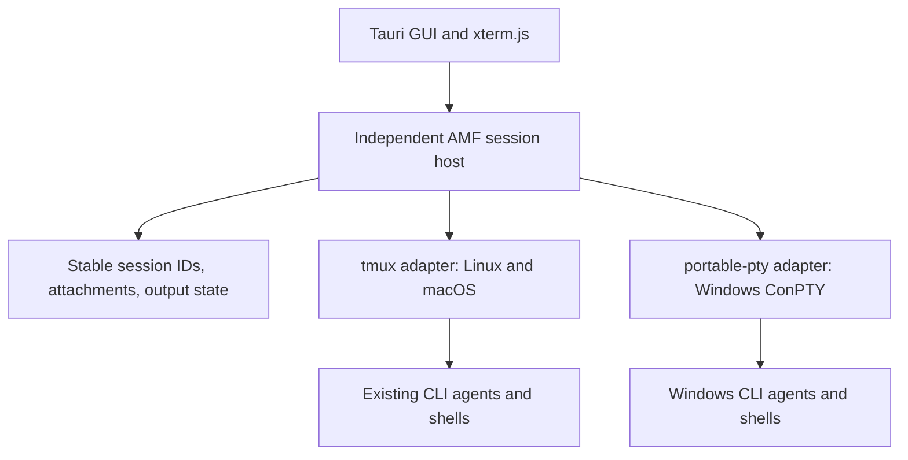

# AMF GUI on macOS and Windows

Investigation date: 2026-09-25. AMF source inspected at
`7fc2e39d74d411681cffc436b66df119ecd77703`; T3 Code source inspected at
[`e5a46d6c5d00b89afba5274a94d42428c8d79763`](https://github.com/pingdotgg/t3code/tree/e5a46d6c5d00b89afba5274a94d42428c8d79763).

This is a source investigation and a proposed follow-up, not a tested native
Windows port. The existing plan still selects native Linux/macOS and Windows
through WSL2/WSLg for the first release.

## Findings

macOS does not require replacing tmux. AMF already has an Apple Silicon GUI
release job, a Finder launch PATH adapter, and Unix terminal/process support.
The remaining work is installed-app validation and distribution polish.

The reported macOS launch failure was the "developer cannot be verified"
warning. The maintainer doesn't currently have a Mac available to set up and
test Developer ID signing and notarization; CI releases remain ad-hoc signed.
The [GUI guide](../../gui/README.md#build-locally-without-a-developer-id) now
documents building and running locally without a Developer ID or paid Apple
Developer account, including prerequisites and development/release commands.
A local build normally avoids the downloaded-app quarantine involved in this
warning, but company restrictions can still apply. This documents an option
for Mac users, not a newly completed macOS runtime test.

### Follow-up: macOS tmux binary selection

A Mac user reports that the tmux copy bundled with AMF caused their local
terminal connection failure; they suspect it is outdated or broken. Confirm
the exact executable and version in their installation, then compare behavior
with Homebrew tmux before changing the default. The TUI release archive copies
Homebrew tmux into the bundle via
[`package-release-bundle.sh`](../../scripts/dev/package-release-bundle.sh),
and [`TmuxRuntime`](../../src/tmux.rs) prefers a `tmux` or `tmux-real` beside
the running executable. The GUI `.dmg` does not currently bundle tmux; it
uses an installed executable found on `PATH`. This report remains a packaging
investigation, separate from recovering feature sessions after `tmux
kill-server`.

Native Windows needs a session backend in addition to platform adaptations.
ConPTY supplies terminal I/O; it does not supply tmux's independent server,
session discovery, reconnectable screen state, or AMF's lifecycle policy.
Tauri and the existing React/xterm.js frontend can remain.

T3 Code's most useful example is its separation of clients from the environment
that runs terminals, providers, and Git. Its terminal implementation uses
`node-pty`. For AMF's Rust backend, `portable-pty` is a candidate to prototype:
its native implementation selects Unix PTYs or Windows ConPTY. This is a
recommendation based on API/source inspection, not AMF compatibility testing.
See [T3's architecture](https://github.com/pingdotgg/t3code/blob/e5a46d6c5d00b89afba5274a94d42428c8d79763/docs/internals/overview.md),
[PTY adapter](https://github.com/pingdotgg/t3code/blob/e5a46d6c5d00b89afba5274a94d42428c8d79763/apps/server/src/terminal/NodePtyAdapter.ts),
and [portable-pty source](https://docs.rs/portable-pty/latest/src/portable_pty/lib.rs.html).

## AMF's current position

| Area | Evidence | Consequence |
| --- | --- | --- |
| Desktop shell | [Tauri manifest](../../gui/src-tauri/Cargo.toml), [frontend dependencies](../../gui/package.json) | Keep the existing desktop/frontend stack. |
| macOS packaging | [Release matrix](../../.github/workflows/release.yml) configures `aarch64-apple-darwin` app/DMG builds with ad-hoc signing | A build path exists; this investigation did not verify a downloaded artifact or run it on a Mac. Developer ID signing, notarization, and Intel builds remain open. |
| Finder environment | [login_path.rs](../../gui/src-tauri/src/login_path.rs) probes the login shell with a three-second deadline | Homebrew tmux and harness discovery already have an implementation to test. |
| Windows today | [GUI installation guide](../../gui/README.md#windows-wsl2) | Linux GUI, tmux, repositories, and harnesses run inside WSL2; WSLg presents the window. |
| Terminal transport | [gui_terminal.rs](../../src/gui_terminal.rs), [TerminalPane.tsx](../../gui/src/TerminalPane.tsx) | Control-mode events mark the pane dirty; AMF captures the current tmux screen and resets/reseeds xterm.js. This is not a direct PTY byte stream. |
| Runtime abstraction | [TmuxOps](../../src/traits.rs) | A useful seam exists, but it mixes tmux window/session operations with harness launch methods. Concrete `TmuxManager` calls still bypass it, including GUI attachment. |
| Persisted identity | [project.rs](../../src/project.rs), [db/store.rs](../../src/db/store.rs) | Features/sessions persist `tmux_session` and `tmux_window`; a new backend needs explicit identity and compatibility handling. |
| Shared compilation | [lib.rs](../../src/lib.rs), [App](../../src/app/mod.rs), [CLI](../../src/cli.rs) | The GUI library includes Unix-specific TUI and runtime code. Replacing the terminal adapter alone will not make it compile for Windows. |

Additional native Windows work is visible in:

- [ipc.rs](../../src/ipc.rs): Unix sockets and file-descriptor wakeups.
- [App](../../src/app/mod.rs), [fswatch.rs](../../src/fswatch.rs), and
  [tmux_observer.rs](../../src/tmux_observer.rs): pipes, FIFOs, and Unix writes.
- [resources/procs.rs](../../src/resources/procs.rs): `ps`, POSIX signals,
  process-tree termination, and start-time checks used to avoid PID reuse races.
- [resources/mem.rs](../../src/resources/mem.rs): Linux/macOS memory probes;
  Windows resource admission needs a platform implementation.
- [app/hooks.rs](../../src/app/hooks.rs), [extension.rs](../../src/extension.rs),
  and [tmux.rs](../../src/tmux.rs): `sh`/`bash` commands and shell scripts.
- [upgrade.rs](../../src/upgrade.rs): Unix filesystem permissions/symlinks.

Some Unix use is already conditional or test-only. This list identifies work
areas, not a compiler-measured count of Windows errors. Windows path handling,
executable discovery, hook delivery, Git worktrees, editors, and harness support
need behavioral validation as well as compilation.

## What T3 Code does

1. **Execution belongs to a server.** Desktop, web, and mobile clients address
   the environment that owns files, credentials, Git, and processes. A bundled
   desktop server follows that same boundary. AMF can borrow this boundary
   without adopting Electron or T3's complete orchestration system.
   [Architecture](https://github.com/pingdotgg/t3code/blob/e5a46d6c5d00b89afba5274a94d42428c8d79763/docs/internals/overview.md).

2. **Terminals have a small process interface.** Spawn, write, resize, kill,
   output, and exit are exposed through `PtyAdapter`. `NodePtyAdapter` implements
   them and accounts for Windows termination and `TERM` behavior. Upstream
   `node-pty` supports macOS/Linux PTYs and Windows ConPTY.
   [Interface](https://github.com/pingdotgg/t3code/blob/e5a46d6c5d00b89afba5274a94d42428c8d79763/apps/server/src/terminal/PtyAdapter.ts),
   [implementation](https://github.com/pingdotgg/t3code/blob/e5a46d6c5d00b89afba5274a94d42428c8d79763/apps/server/src/terminal/NodePtyAdapter.ts),
   [node-pty](https://github.com/microsoft/node-pty).

3. **The server retains output for reconnects.** It streams incremental output
   and caps retained history by both lines and bytes. Replay suppresses terminal
   query replies so historical escape sequences do not send fresh input to the
   shell. The current web renderer uses Ghostty/WASM; the server contract keeps
   rendering separate, so that renderer choice is not a prerequisite for AMF.
   [Terminal runtime](https://github.com/pingdotgg/t3code/blob/e5a46d6c5d00b89afba5274a94d42428c8d79763/docs/internals/terminal-runtime.md).

4. **Provider chat is separate from terminal sessions.** For example, Codex uses
   its app-server integration and Claude uses the Agent SDK. Adopting that model
   would be a separate AMF product/integration change; terminal portability can
   preserve AMF's interactive CLI workflows.
   [Codex runtime](https://github.com/pingdotgg/t3code/blob/e5a46d6c5d00b89afba5274a94d42428c8d79763/apps/server/src/provider/Layers/CodexSessionRuntime.ts),
   [Claude adapter](https://github.com/pingdotgg/t3code/blob/e5a46d6c5d00b89afba5274a94d42428c8d79763/apps/server/src/provider/Layers/ClaudeAdapter.ts).

5. **Windows requires explicit launch handling.** T3 tries PowerShell and cmd
   candidates, resolves Windows executable extensions, and handles `.cmd`/`.bat`
   launchers with platform-specific quoting. Its desktop environment adapter
   also handles shell/profile discovery. These are useful porting examples.
   [Terminal manager](https://github.com/pingdotgg/t3code/blob/e5a46d6c5d00b89afba5274a94d42428c8d79763/apps/server/src/terminal/Manager.ts),
   [shell helpers](https://github.com/pingdotgg/t3code/blob/e5a46d6c5d00b89afba5274a94d42428c8d79763/packages/shared/src/shell.ts),
   [desktop environment](https://github.com/pingdotgg/t3code/blob/e5a46d6c5d00b89afba5274a94d42428c8d79763/apps/desktop/src/shell/DesktopShellEnvironment.ts).

There is a lifecycle limit to this example: T3's terminal manager terminates its
processes on shutdown. Its documentation says server updates/restarts interrupt
terminals and agent turns, and its background-service installation supports
Linux/macOS, not Windows. Retained history is not a surviving process.
[Manager cleanup](https://github.com/pingdotgg/t3code/blob/e5a46d6c5d00b89afba5274a94d42428c8d79763/apps/server/src/terminal/Manager.ts#L2482),
[service documentation](https://github.com/pingdotgg/t3code/blob/e5a46d6c5d00b89afba5274a94d42428c8d79763/docs/user/background-service.md).

## Platform options

Effort below is relative engineering scope, not a delivery estimate.

| Route | Where agents run | Scope | Assessment |
| --- | --- | --- | --- |
| Native macOS + tmux | macOS | Smallest: validation and packaging | Recommended immediate macOS path. |
| Current WSLg GUI | WSL Linux | Existing path | Keep available while investigating native Windows. |
| Native Windows Tauri GUI + WSL backend | WSL Linux | Medium: process/API boundary, WSL discovery and packaging | Useful if a native window is the goal and WSL remains acceptable. |
| Native Windows GUI + native session host | Windows | Largest: PTY/session ownership, platform services, compatibility and testing | Required for Windows repositories/tools without WSL. |

For a WSL backend, all workspace operations must remain in WSL: Git, paths,
database, credentials, hooks, and harnesses. The Windows frontend should call
that backend over a defined, authenticated transport rather than open the Linux
SQLite database itself. This also requires a frontend/protocol build that does
not link the current Unix-only shared library. A native window alone does not
make the execution environment native Windows.

## Recommended native Windows design to prototype

The session host must outlive a GUI exit and own the PTY handles, child guards,
identity checks, and output retention. Closing an attachment releases a viewer;
an explicit stop terminates a session. ConPTY teardown terminates attached
console applications, so PTYs owned directly by the GUI cannot preserve the
current close/reopen behavior. An independent process does not necessarily need
an installed OS service in the first prototype.
[Microsoft's pseudoconsole lifecycle](https://learn.microsoft.com/en-us/windows/console/creating-a-pseudoconsole-session).

Prototype a semantic session interface using AMF's feature/session UUIDs:
start, list/status, attach/detach, input, resize, and stop. Keep harness launch
specifications separate from PTY operations. Initially wrap the existing tmux
behavior, then add the Windows implementation. Preserve Unix TUI access and
existing tmux session identities; do not convert running sessions as a side
effect of installing the new GUI. A new backend needs explicit metadata and a
version compatibility policy before sharing persisted records with older AMF.

Define separate initial-snapshot and incremental-output events. The existing
frontend resets xterm.js on each event, so connecting raw PTY output to that
event unchanged would lose terminal state. A byte ring alone also cannot
guarantee reconstruction of a full-screen application's state after truncation.
Evaluate server-side terminal state/snapshots, bounded scrollback, ordered
reattachment, replay without query replies, and resize ownership together.

Keep platform operations behind small boundaries: executable/argument handling,
IPC and wakeups, process identity/termination, memory inspection, paths, and
hooks. Windows stop behavior must account for descendant processes and PID
reuse, preserving the intent of the current guards. Compile only portable
contracts/domain code into a native frontend; isolate Unix TUI modules where
needed rather than filling the GUI with conditional calls.

## Concrete follow-up validation

1. **macOS installed-app pass:** install the DMG on Apple Silicon, launch from
   Finder with Homebrew tmux and installed harnesses, create a feature, interact,
   resize, close/reopen, reattach from the TUI, and stop. Check missing executable
   errors, sleep/wake, and upgrade continuity. Complete Developer ID signing and
   notarization; decide Intel support separately.
2. **Windows feasibility prototype:** a small Rust session host using
   `portable-pty`, a native Tauri window with the current xterm.js component,
   PowerShell/cmd, and one locally supported harness. Use temporary state and
   explicit opt-in to run a real harness. Mock paid execution in automated tests.
3. **Lifecycle acceptance:** close or crash the GUI while a child is working;
   reconnect without duplicate launch, reconstruct the screen, resize, interrupt,
   paste a multiline prompt, and stop the process tree. Separately test host
   shutdown/restart; do not promise live-process survival across host failure.
4. **Portability acceptance:** paths with spaces/Unicode, `.cmd` CLI launchers,
   UTF-8 and alternate-screen output, sustained output with bounded memory,
   notification hooks, resource gates, worktree creation/removal, and each of
   AMF's four harnesses. Availability of a PTY library does not establish native
   support for every harness or hook.
5. **Integration milestone:** add native Windows and macOS validation alongside
   existing Linux checks; run the full parallel Rust suite, formatting, strict
   Clippy, frontend checks, and installed-package lifecycle checks before
   advertising the additional platform.

No runtime code or dependencies changed in this investigation. No macOS or
Windows execution was performed, and no build/test result establishes native
Windows compatibility yet.
