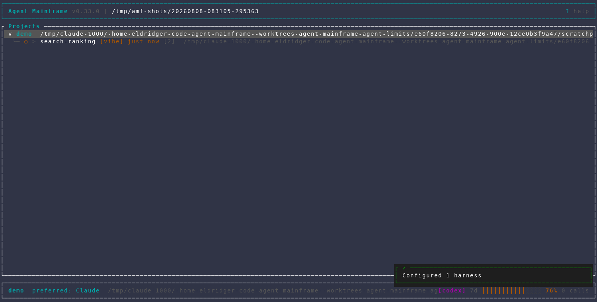
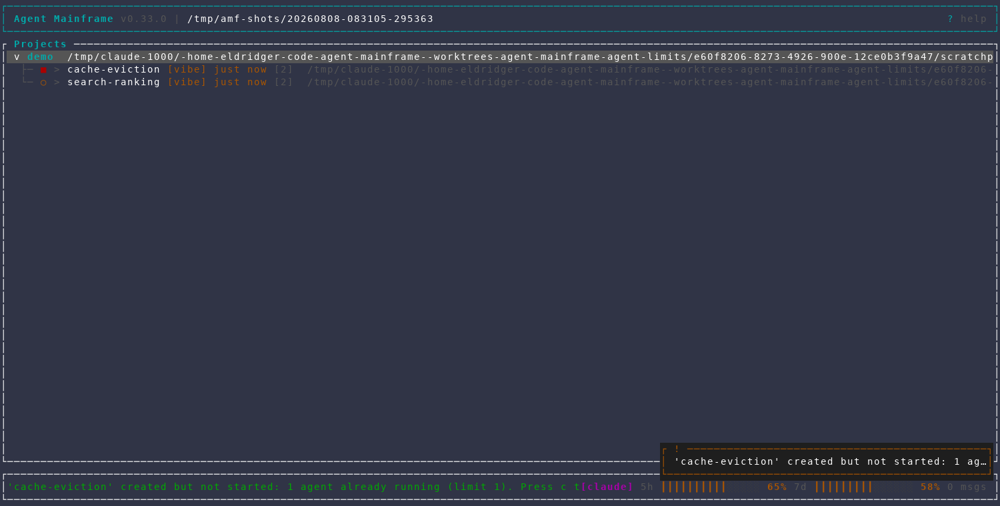
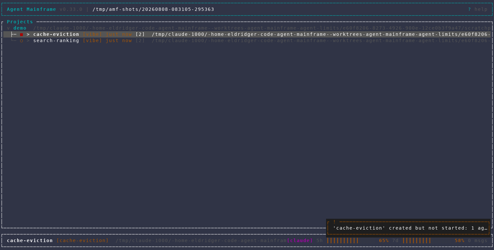
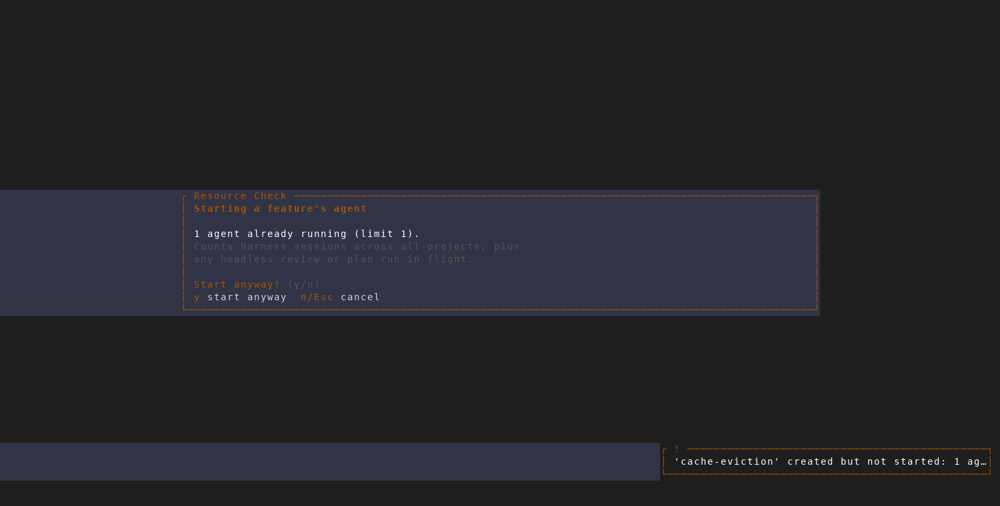
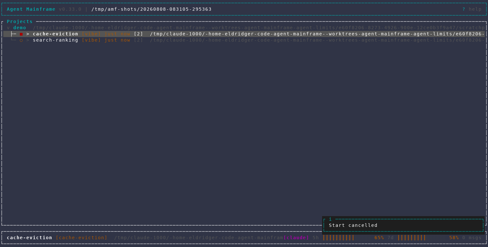
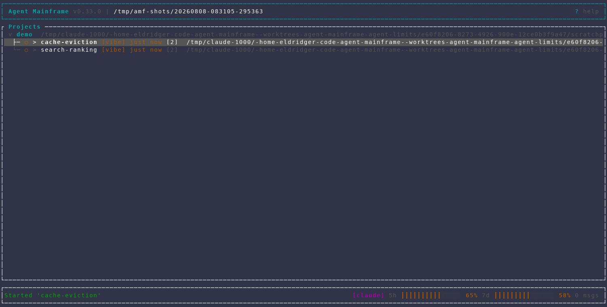
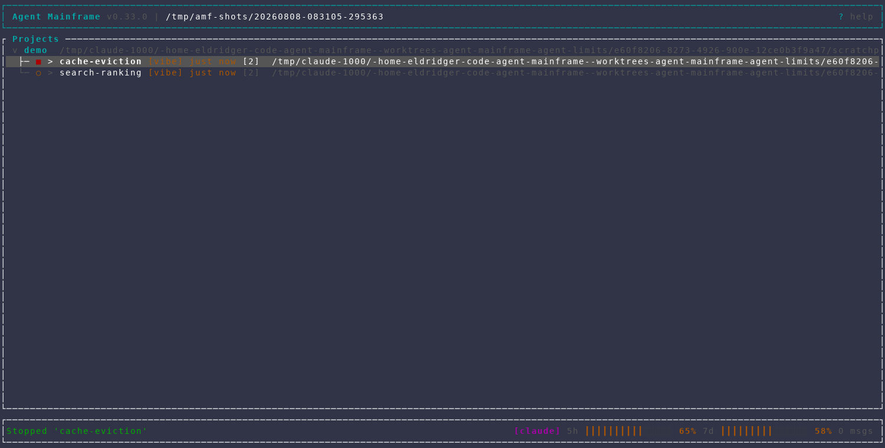
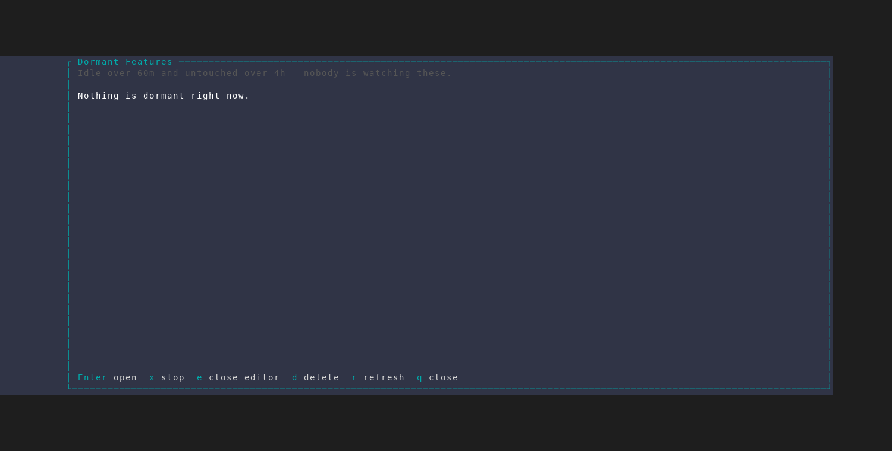
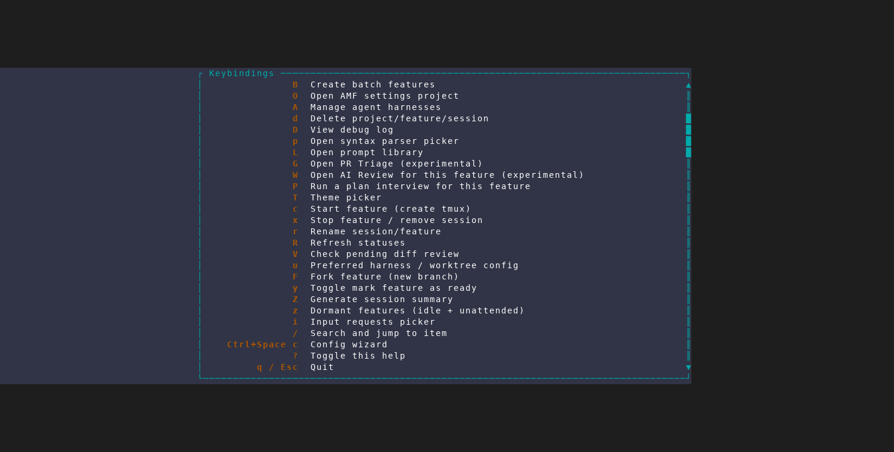

# Agent limits, autostart backoff, and dormant features

Captured from an isolated, throwaway AMF instance
(`scripts/dev/screenshot/amf-capture.sh`, 150x40, scenario
`scripts/dev/screenshot/scenarios/agent-limits.txt`) against a scratch demo
repo, with `"max_concurrent_agents": 1` passed via the new `--config` flag —
the interesting behavior is what happens *at* the limit, and a capture rarely
finds four agents already running. No real project, database, or tmux session
was touched.

## 1. One agent running, at the limit

The seeded `search-ranking` feature autostarted its Claude session. With the
limit set to 1, the machine is now exactly at its cap.

## 2. Creating a second feature does not queue a dialog

`cache-eviction` is created through the automation API while the machine is at
its limit. Creation paths deliberately never raise the confirmation dialog — a
batch create would queue one per feature, and the automation API has nobody to
answer them — so the feature is created, left stopped, and the reason is said
out loud: *"'cache-eviction' created but not started: 1 agent already running
(limit 1). Press c to start it."*

## 3. The stopped feature, selected

## 4. `c` — now it asks, because a person is asking

The gate names what tripped and by how much, and says what it counts: harness
sessions across **all** projects, plus any headless review or plan-interview run
in flight. Terminals, editors, and TODOs sessions are not counted and never
raise it. If memory were also low, both would appear here — one dialog, not two
prompts in a row.

## 5. `n` — nothing was started

The feature is still stopped (`■`), and the status line confirms the start was
dropped rather than deferred.

## 6. `y` — started anyway

The gate is advisory in both directions: it never refuses, it only makes sure
the decision was deliberate. The stashed start is replayed exactly as it would
have run unprompted.

## 7. `x` — stopped again

A stop also closes the editor AMF opened for the feature and the language
servers under it, reporting what it closed or deliberately left alone. This
scratch instance has no editor, so the message is the ordinary one.

## 8. `z` — dormant features

Dormancy is an **and**: the agent has produced no output for
`dormant_idle_minutes`, *and* the feature has not been opened for
`dormant_last_accessed_hours`. Both thresholds are named in the header, which is
the answer to "why is this empty?". Seconds into a capture nothing qualifies —
the correct answer, and the one this frame is showing.

## 9. The new `z` binding in the help overlay

