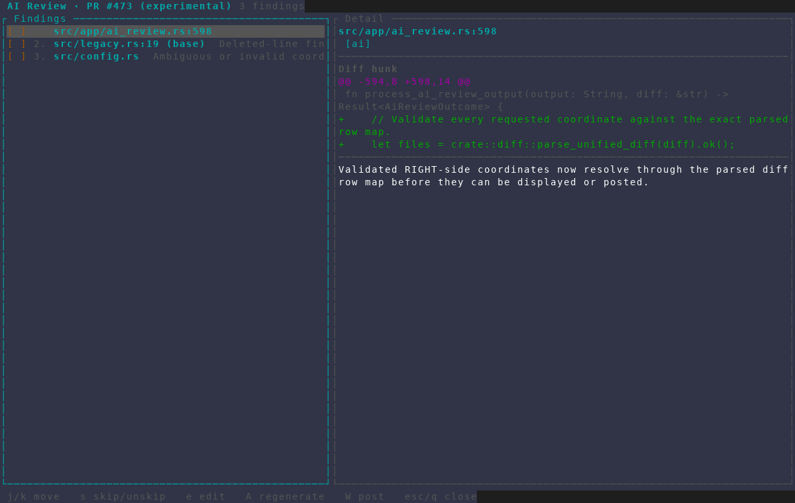
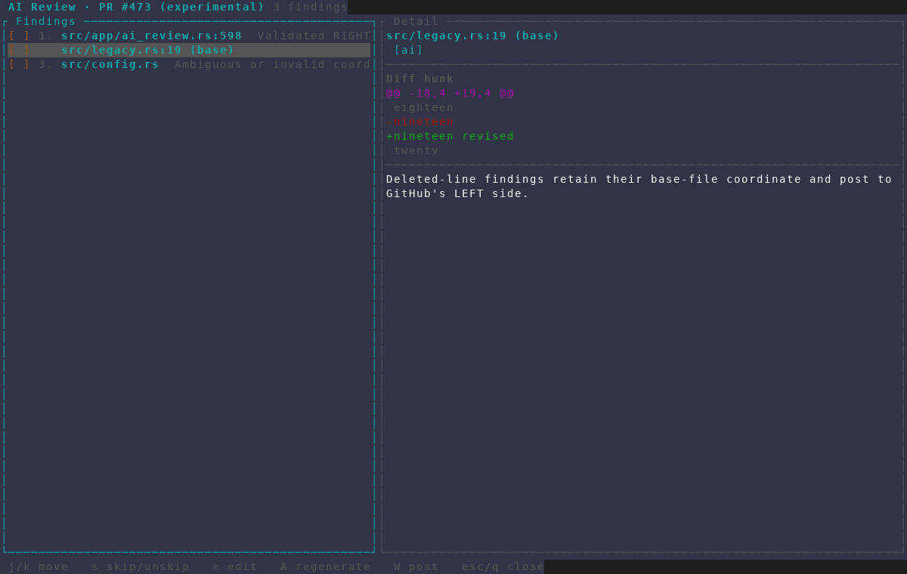
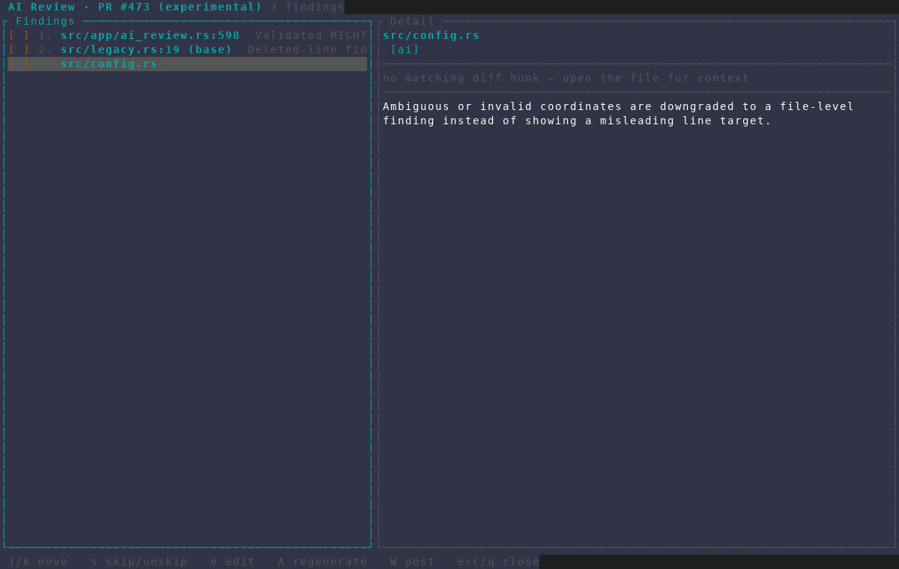

# AI Review line mapping

Captured from an isolated AMF instance with three representative cached
findings. A stubbed read-only `gh` resolved fixture PR #473; no AI agent ran and
nothing was written to GitHub.

## Current-file anchor

A validated current-file finding keeps its one-based source line and renders
the matched diff context.

## Deleted base-file anchor

A finding about a removed line is explicitly marked `(base)` and retains its
LEFT-side diff context.

## Ambiguous location fallback

An ambiguous or invalid coordinate retains the file and finding text without
showing a line number that may point at unrelated code.

All frames were captured at 120×40 with the isolated
`scripts/dev/screenshot/amf-capture.sh` harness. Their text captures were
asserted before the PNGs were visually inspected for color and clipping.
