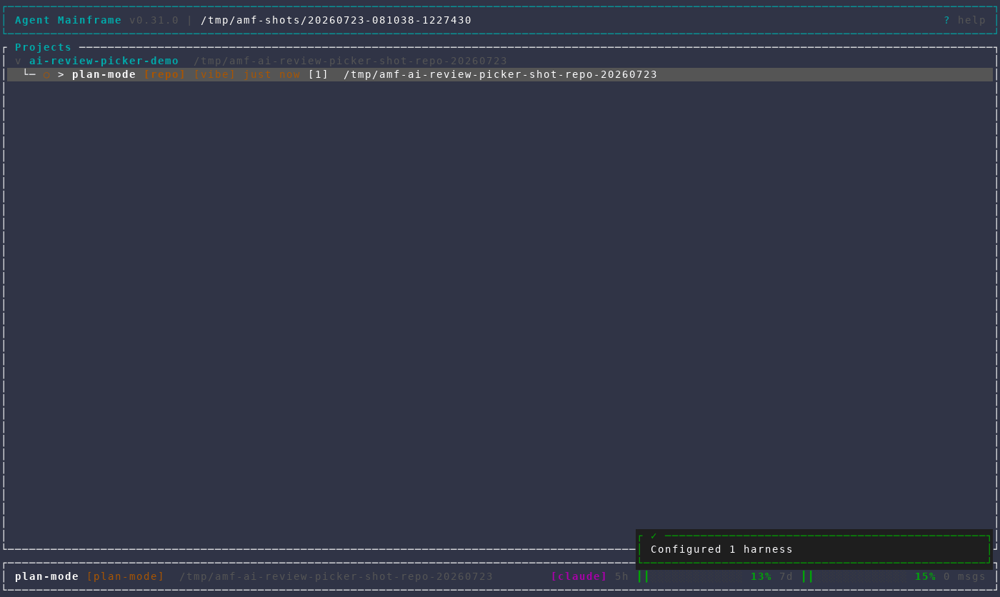

# AI Review picker back navigation

Captured from an isolated AMF instance against open PR #483. The walkthrough
stops before starting the paid AI Review pass, so it performs no GitHub write
and spends no agent tokens.

The sequence demonstrates:

1. choosing the AI Review harness;
2. opening the harness-specific model picker;
3. entering and leaving the custom-model editor;
4. returning from the model list to the harness picker with the current
   harness still highlighted.

