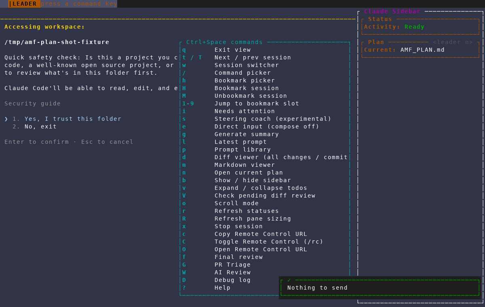
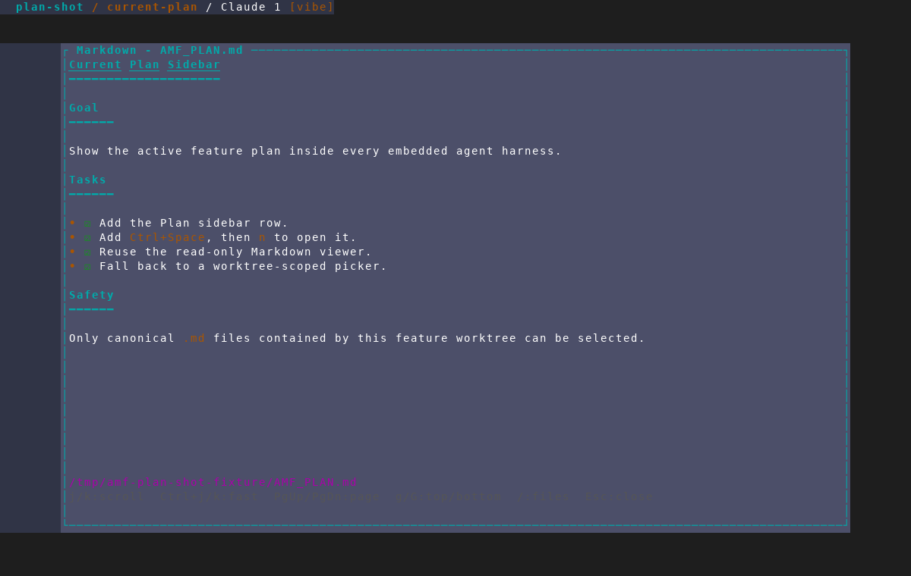
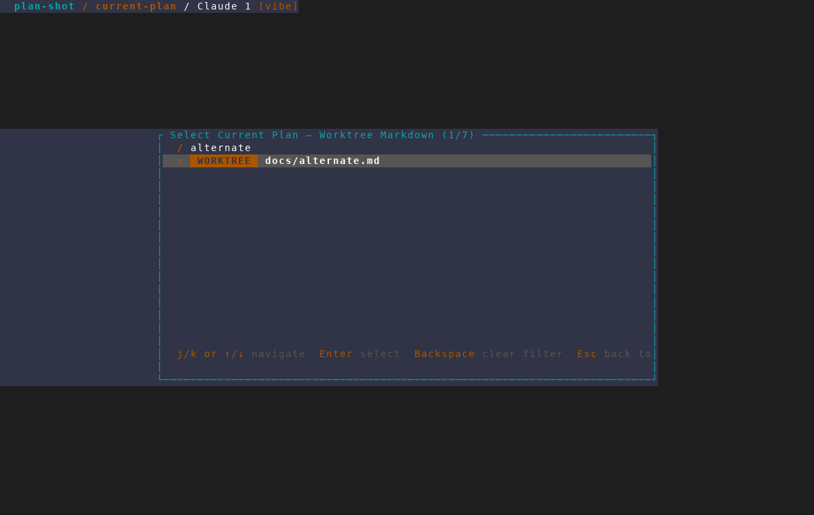
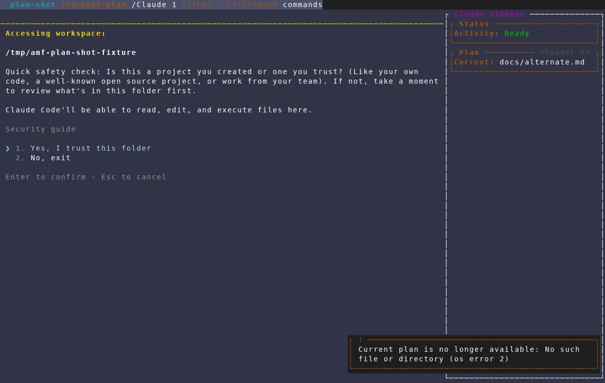

# Current plan in the agent sidebar

Captured with the repository's `/amf-screenshot` workflow from an isolated AMF
instance against a throwaway project. The walkthrough verifies the current-plan
sidebar section and shortcut, the read-only Markdown viewer, worktree-scoped
plan selection, and persistence of a manually selected replacement.

## 1. The current plan is visible and has a leader shortcut

The agent sidebar identifies `AMF_PLAN.md`, and the `Ctrl+Space` menu exposes
`n` as **Open current plan**.

## 2. The current plan opens in AMF's Markdown viewer

The plan opens read-only without leaving the feature's embedded session flow.

## 3. A replacement is limited to Markdown inside the worktree

After the default plan is moved away, the same shortcut opens a filtered
worktree Markdown picker.

## 4. The selected replacement is remembered

Returning to the agent shows the replacement as the feature's current plan.

