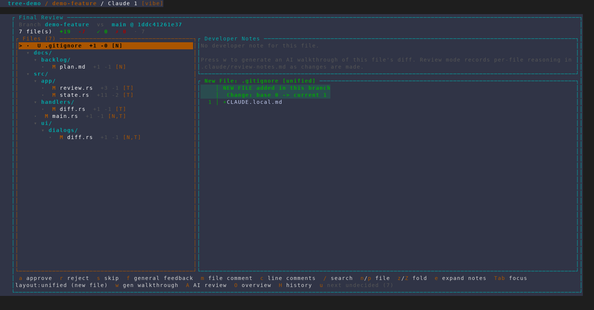
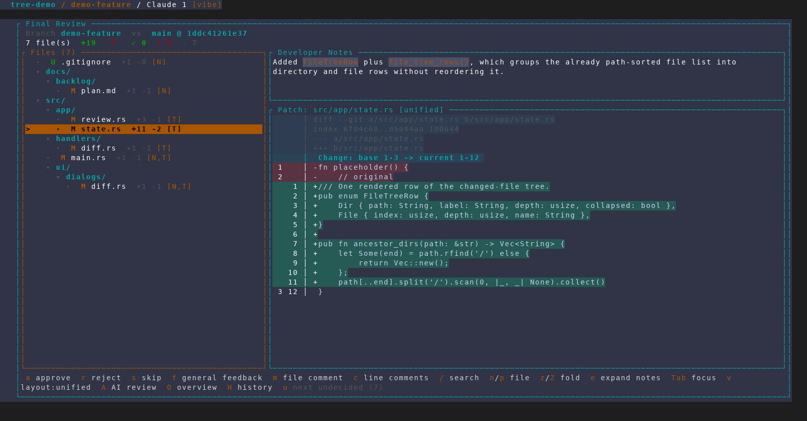
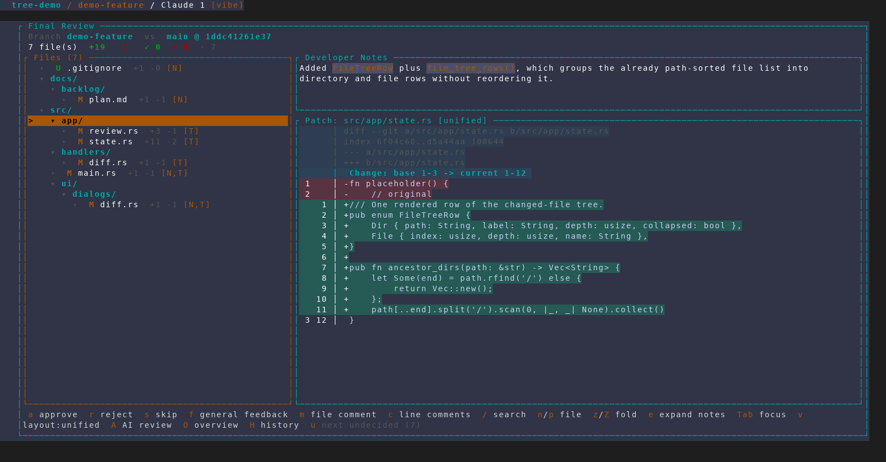
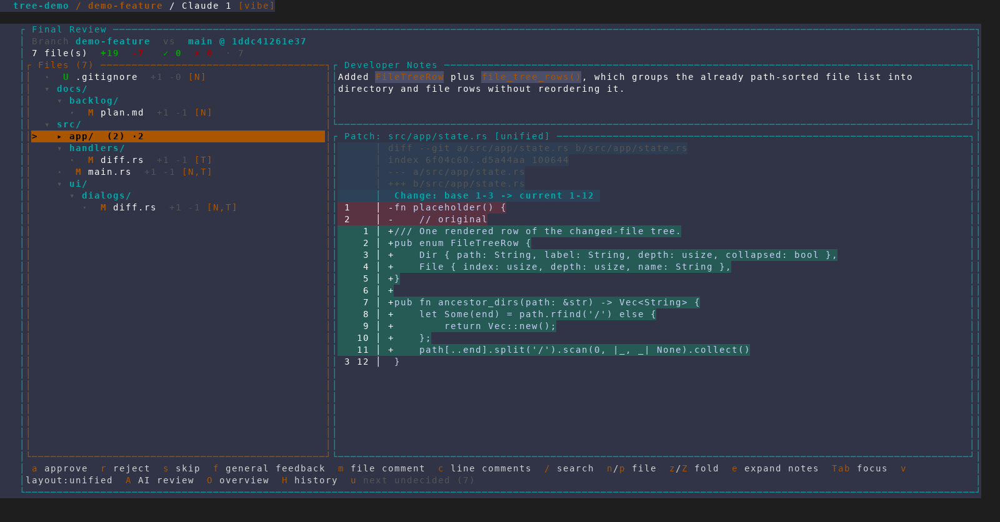
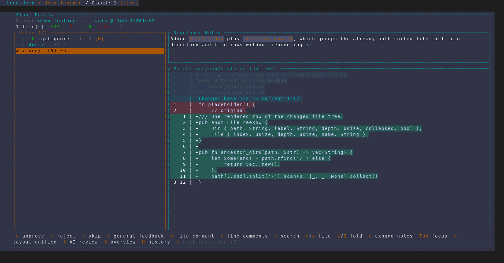
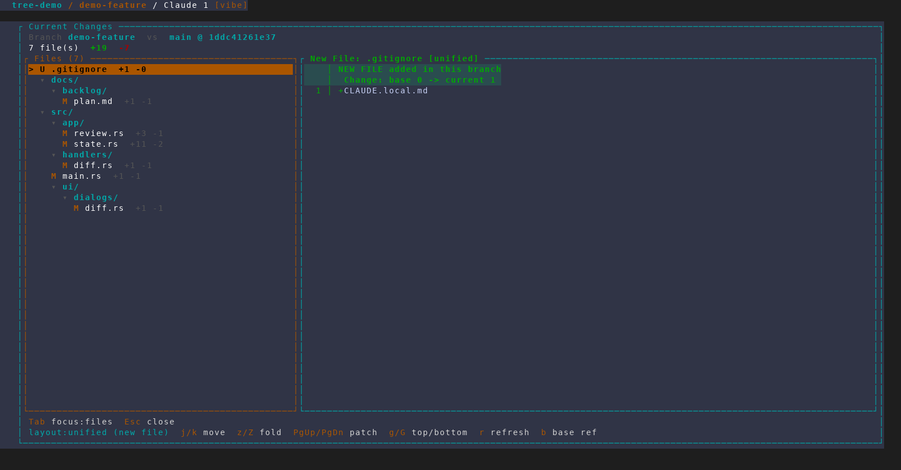
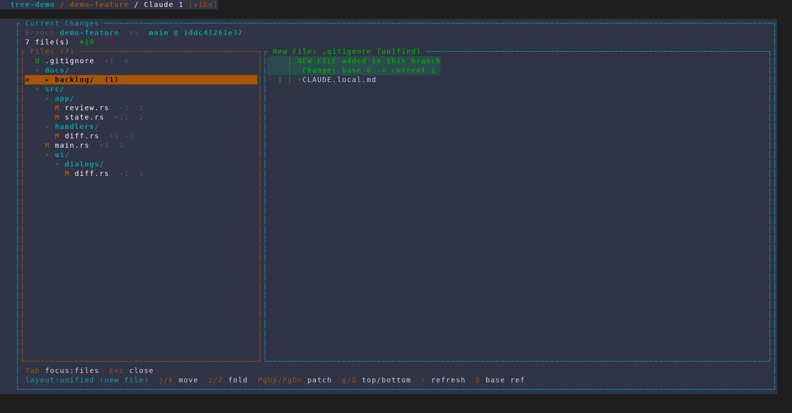

# Hierarchical file tree in the diff viewers

Captured from an isolated, throwaway AMF instance
(`scripts/dev/screenshot/amf-capture.sh`, 160x44) against a scratch demo repo
whose changeset deliberately spans a repo-root file, `docs/backlog/`,
`src/app/`, `src/handlers/` and `src/ui/dialogs/`, so the tree has real depth.
No real project, database or tmux session was touched.

Frames 1–5 are Final Review; frames 6–7 are the plain diff viewer
(leader `d`), which shares the same file-list widget and fold bindings.

## 1. The tree

Directory headers absorb the shared path prefix and file rows show only their
basename, indented by depth. Every existing marker survives the regrouping:
verdict (`·`), status (`M` / `U`), `+n -n` counts, and the `[N]` / `[T]` risk
flags.

Note `main.rs` rendering *between* `handlers/` and `ui/` — exactly where
full-path sorting puts it. The tree groups without reordering, so `n` / `p`
file navigation and the visual order still agree.

## 2. File navigation and the shorter Developer Notes panel

`n` walks *files*, not rows, so it moves through the tree unchanged — three
presses land on `src/app/state.rs` and its developer note. The Developer Notes
panel now takes ~20% of the right column (down from ~40%), leaving the diff the
rest; `e` still expands it to full height. The footer carries the new
`z/Z fold` hint.

## 3. Stepping onto a directory row

In the file list `j` / `k` walk tree rows including directory headers, and `h`
steps out of a file onto its parent directory. The patch panel keeps showing
`state.rs` — parking the cursor on a directory never changes what is being
diffed.

## 4. Folding a directory

`z` (or Enter) folds the cursored directory. The collapsed row summarises what
it hides — `(2)` files, `·2` still undecided — so folding can never bury
outstanding work. A `✗n` rejected count and a `Δ` changed-since-last-review
marker appear the same way when they apply.

Folding is strictly a view concern: filters, counts and file-order navigation
still see every file, and landing on a file inside a fold re-expands its
ancestors rather than stranding the selection.

## 5. Folding the whole tree

`Z` folds every directory (and folds back open on a second press), leaving the
repo-root file plus one row per top-level directory. The cursor parks on the
outermost directory holding the selected file, so a row always stays
highlighted.

## 6. The same tree in the plain diff viewer (leader `d`)

The tree is not a Final Review feature — the plain diff viewer shares the file
list, so leader `d` groups identically. Note the absence of the verdict column:
there are no verdicts outside a review, and the rest of the row is unchanged.

## 7. Folding in the plain diff viewer

`j`/`k`, `z`/`Z` and `h`/`l` work exactly as they do in Final Review. The
collapsed row reports `(1)` — just the file count, since the undecided,
rejected and changed-since-last-review counts only exist during a review.

