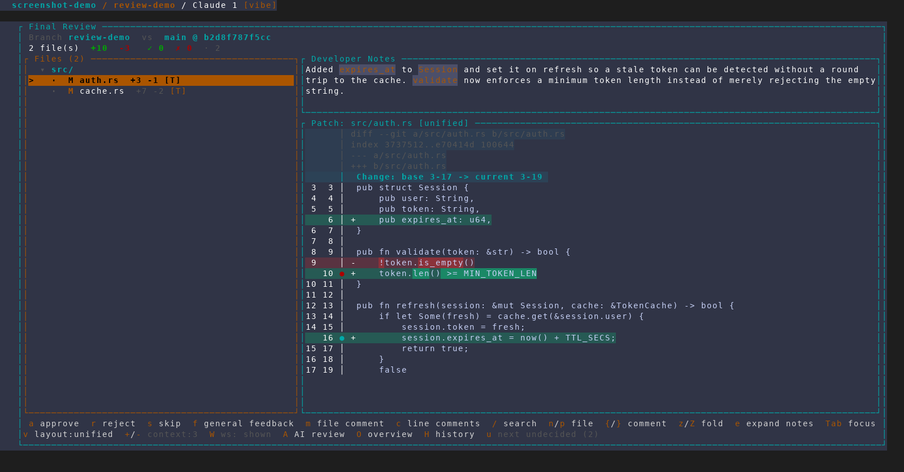
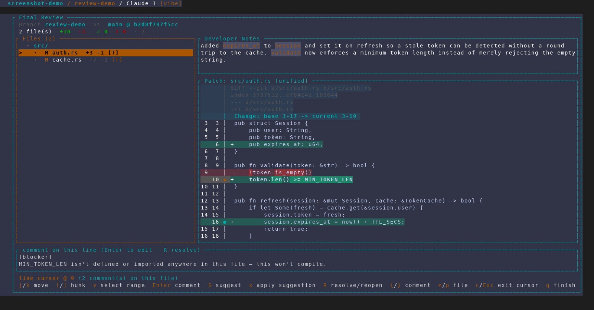
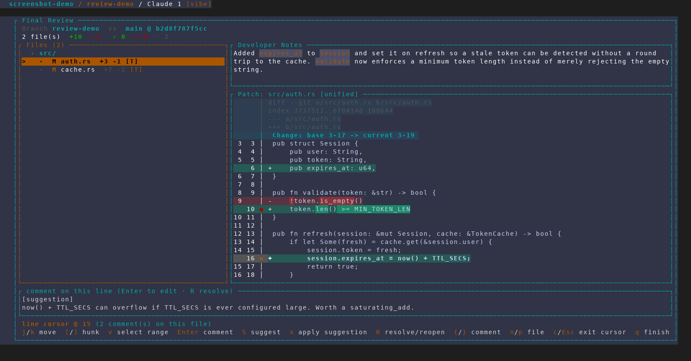
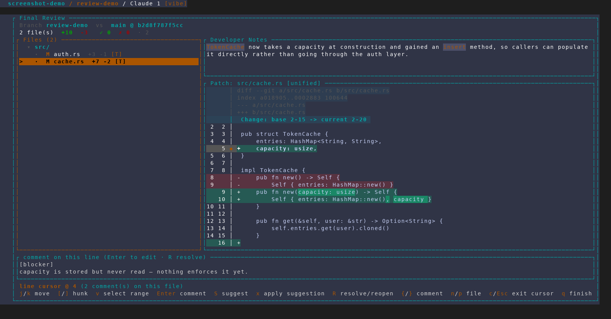
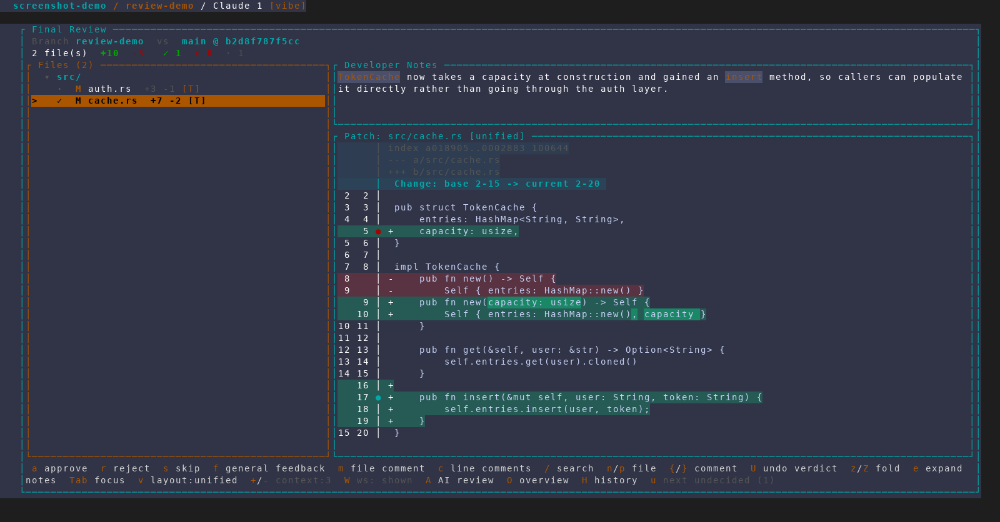
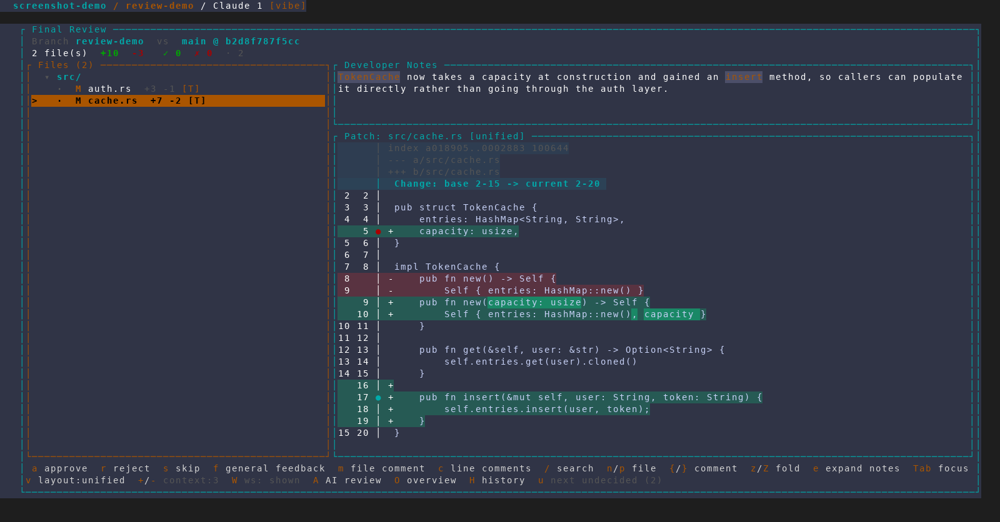

# Cross-file comment navigation (`{` / `}`) and undo verdict (`U`)

Captured from an isolated, throwaway AMF instance
(`scripts/dev/screenshot/amf-capture.sh`, 160x44) against a scratch demo repo
whose `review-demo` branch changes two files — `src/auth.rs` and
`src/cache.rs` — with four line comments seeded into
`.claude/final-review-progress.json` (a blocker and a suggestion on each file)
and per-file developer notes in `.claude/review-notes.md`. No real project,
database or tmux session was touched.

## 1. The review before any navigation

Two files, both undecided. The comment set is already loaded, so the footer
carries the new `{/}` comment hint — it is only drawn once the review actually
has a comment to jump to.

## 2. `}` — first comment in the review

With the line cursor off, `}` turns it on and lands on the first comment of the
file already on screen, rather than skipping past it. The gutter shows the
blocker marker (`◆`) and the peek box below the diff reads the comment back.

## 3. `}` again — next comment, same file

Still inside `src/auth.rs`, now on the `[suggestion]` comment further down the
diff. This is the part `Tab` could already do — for AI drafts only.

## 4. `}` again — across the file boundary

The third press leaves `src/auth.rs` entirely and selects `src/cache.rs`,
landing on its blocker comment. The file list selection, the Developer Notes
panel and the patch panel all follow. `Tab` could never do this: it cycles
drafts within the current file.

## 5. `{` — back across the boundary

`{` walks the same itinerary in reverse and wraps at either end, so stepping
back from the first comment of `src/cache.rs` returns to the *last* comment of
`src/auth.rs`.

## 6. `a` approves — and the `U undo verdict` hint appears

`c` leaves cursor mode, `a` approves `src/cache.rs`: the header counts move to
`✓ 1 · 1` and the row's verdict marker becomes `✓`. Because there is now a
verdict to take back, the footer grows the `U undo verdict` hint — like `{/}`,
it stays hidden while it would do nothing.

## 7. `U` — verdict taken back

The counts return to `✓ 0 · 2`, `src/cache.rs` is undecided again, and the
selection is on that file — the point of the undo, since `a` / `s` / `r` all
advance away from the file they just decided. The `U` hint is gone again with
the stack empty. Only the verdict is undone; comments, suggestions and general
feedback are untouched.

