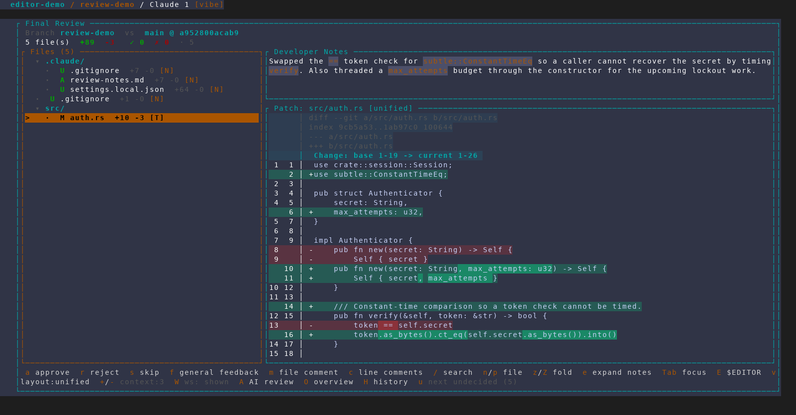
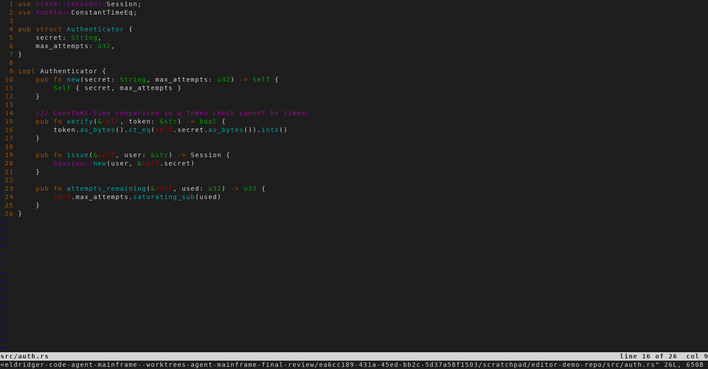
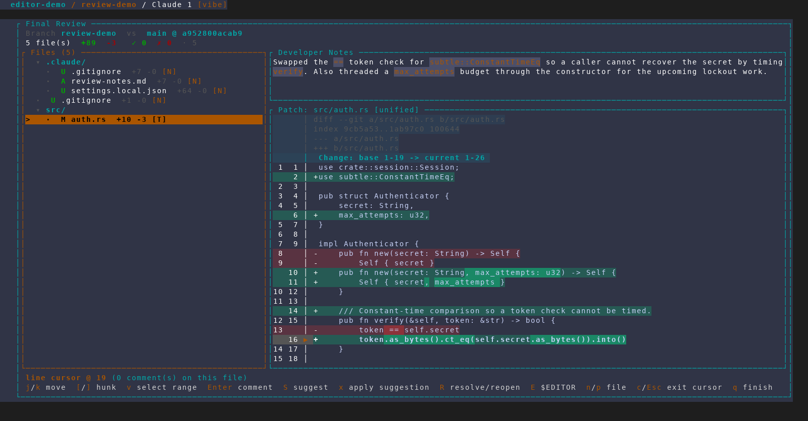

# Open at the cursored line in `$EDITOR` (`E`)

Captured from an isolated, throwaway AMF instance
(`scripts/dev/screenshot/amf-capture.sh`, 160x44) against a scratch demo repo
whose `review-demo` branch hardens `src/auth.rs` — swapping a `==` token check
for `subtle::ConstantTimeEq` and threading a `max_attempts` budget through the
constructor — with a matching developer note in `.claude/review-notes.md`. The
scratch instance was launched through a wrapper exporting
`EDITOR="vim -u <demo-vimrc>"` so the editor in the capture is deterministic and
shows line numbers and a ruler. No real project, database or tmux session was
touched.

## 1. The review, before entering cursor mode

`src/auth.rs` selected, no verdict yet. The footer carries the new `E $EDITOR`
hint. It is drawn only for a file there is something to open — a deleted or
binary file hides it rather than advertising a key that could only explain why
it won't work.

## 2. Cursor mode, parked on the constant-time comparison

`c` activates the line cursor, which lands on the file's first changed line;
`j` walks down to `token.as_bytes().ct_eq(...)` — addressable line 19 in the
footer's counter, which is line **16** on the current side of the file. The
cursor-mode footer carries its own `E $EDITOR` hint alongside `R
resolve/reopen`.

## 3. `E` — the TUI suspends and vim opens at that line

AMF tears down raw mode and the alternate screen and hands the terminal to
`$EDITOR`, which opens `src/auth.rs` with the cursor already on the line being
reviewed. vim's statusline reads `line 16 of 26` — the new-side line number of
the cursored diff line, not the diff-relative one. Because the review cursor
indexes lines that include removals (which have no counterpart on disk), a
cursor parked on a deleted line would instead land on the nearest surviving
line above it.

## 4. Quitting the editor restores the review exactly

`:q!` returns to Final Review with the same file selected, the same cursor
position, and the same scroll offset. This frame is **byte-identical** to frame
2 — the capture files compare equal — so nothing about the review was disturbed
by the round trip.

Had the file actually been edited, AMF would have noticed the changed
size/mtime and reloaded the diff through the ordinary refresh path (which
re-anchors comments), rather than leaving annotations on hunks that had moved.

