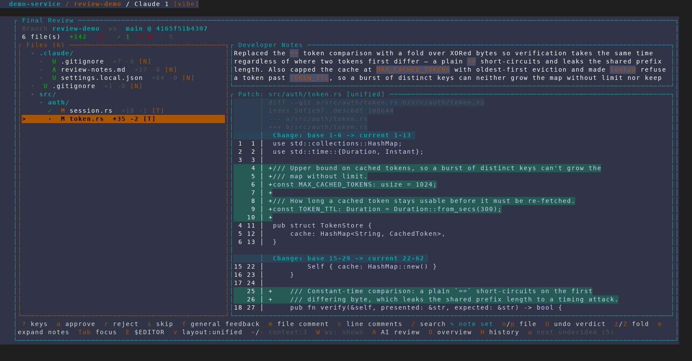
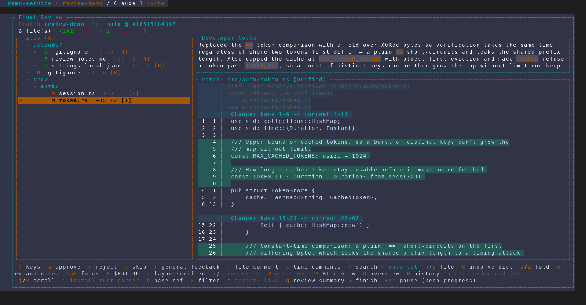
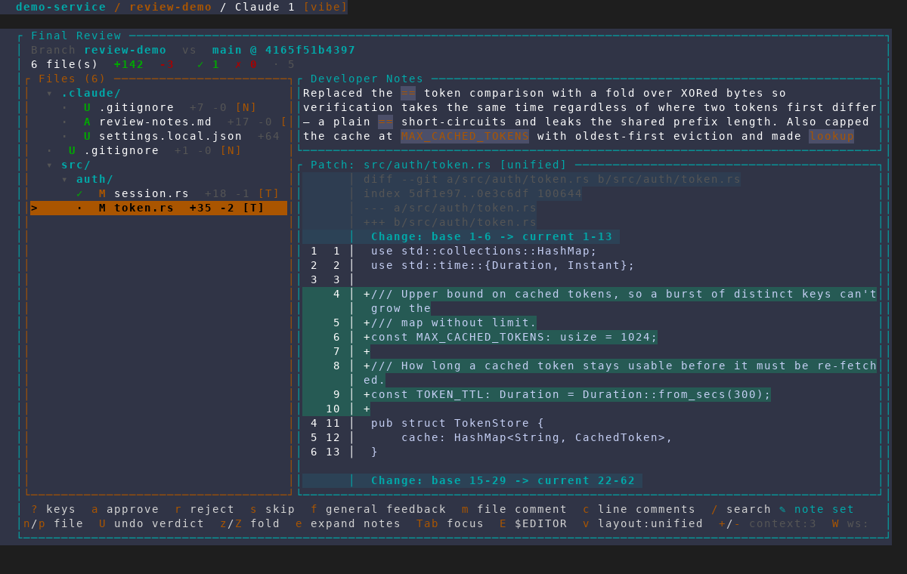
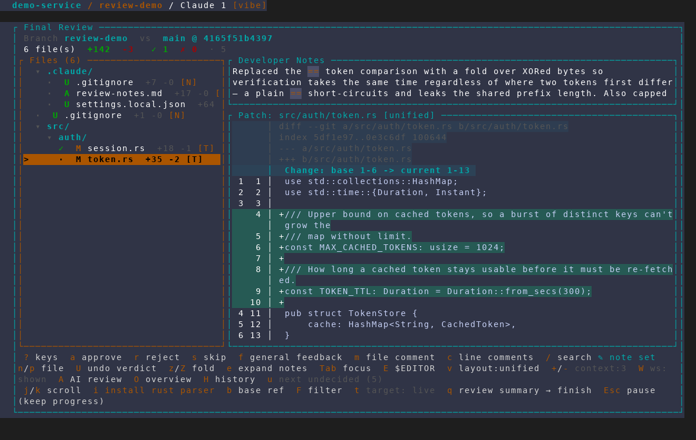
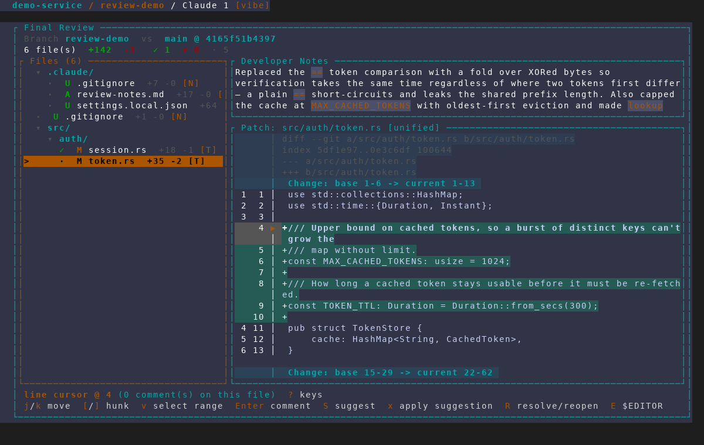
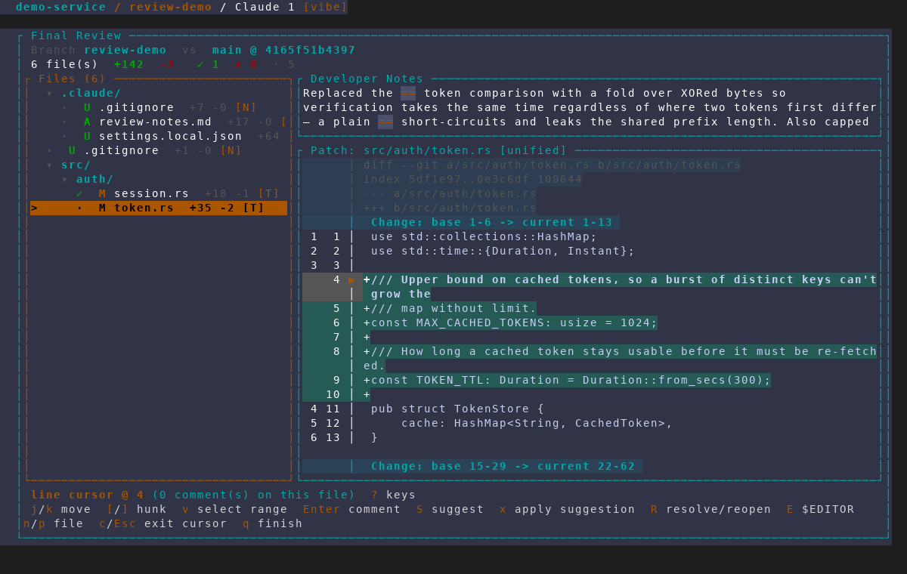
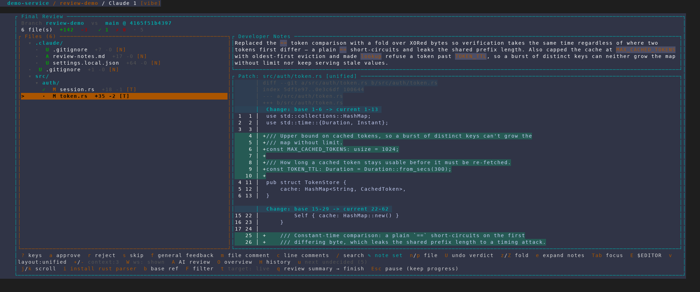
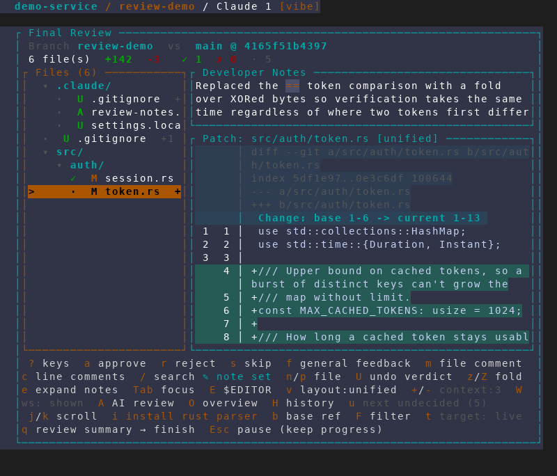

# The review footer's second hint row is no longer clipped

Captured from an isolated, throwaway AMF instance
(`scripts/dev/screenshot/amf-capture.sh`, scenario
`scripts/dev/screenshot/scenarios/final-review-footer-rows.txt`) against a
scratch demo repo whose `review-demo` branch makes token verification
constant-time, bounds the token cache and puts a TTL on lookups, with matching
developer notes in `.claude/review-notes.md`. No real project, database or tmux
session was touched.

Every "before" frame was captured from a build with the fix reverted, and every
"after" frame from the same scenario at the same geometry with it applied — so
each pair differs only by the fix.

The scenario deliberately drives the footer to its densest: it approves a file
(earning `U undo verdict`) and sets general feedback (`✎ note set`) before
capturing, because that is the state the bug hid behind.

## 1 & 2. 160 columns — the whole second row, gone

Identical screens but for the footer. In the "before" frame the first hint row
(verdicts, comments, navigation, layout, whitespace, AI passes, history,
undecided count) wraps into **both** rows of the 2-row footer, so the second row
is never drawn at all:

> `j/k scroll` · `i install rust parser` · `b base ref` · `F filter` ·
> `t target: live` · `q review summary → finish` · `Esc pause (keep progress)`

Those are the round-level keys — how to change what you are diffing against,
where fixes get dispatched, and how to leave without finishing. The hardest keys
to guess were the ones being dropped.



After: the footer measures the hints it is about to draw and grows to three
rows, and the second row is rendered into an area of its own. The patch panel
gives up exactly one line.



## 3 & 4. 120 columns — and the first row was losing its tail too

Narrower makes it worse, not just as bad: the "before" frame cuts off
mid-hint at `W ws:` — everything from there on (`A AI review`, `O overview`,
`H history`, `u next undecided`) is gone along with the entire second row.



After, at four hint rows plus the round-level row:



## 5 & 6. Cursor mode, where the two rows swap roles

With the line cursor active the *first* line is the short one (the position
label) and the key row is what wraps — so it is the second row that clips.
Before, `n/p file`, `c/Esc exit cursor` and `q finish` are missing: the key
that leaves cursor mode was not on screen.





## 7 & 8. It holds at both extremes

200 columns — the first row still needs two rows of its own, and the
round-level row sits below it rather than being displaced by it:



80 columns — the hints wrap to six rows total (four + two), still under the
`REVIEW_HINT_MAX_ROWS` ceiling of 8, past which the hints are capped so they
cannot crowd the diff off a short terminal:



## Reproducing

```bash
scripts/dev/screenshot/amf-capture.sh \
  --scenario scripts/dev/screenshot/scenarios/final-review-footer-rows.txt \
  --seed <project.json> --seed-feature <feature.json> \
  --geometry 160x44
```

Swap `--geometry` for `200x44`, `120x40` or `80x36` to see the width dependence;
`--amf-bin` points the same scenario at a differently-built binary, which is how
the before/after pairs above were produced.
