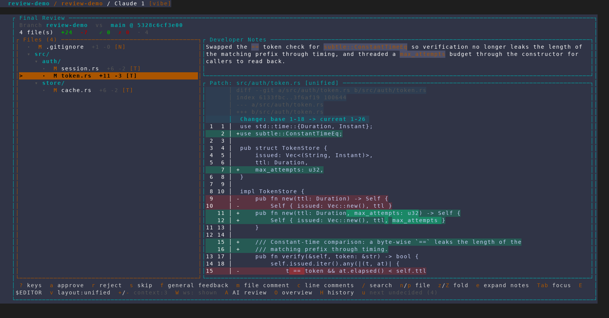
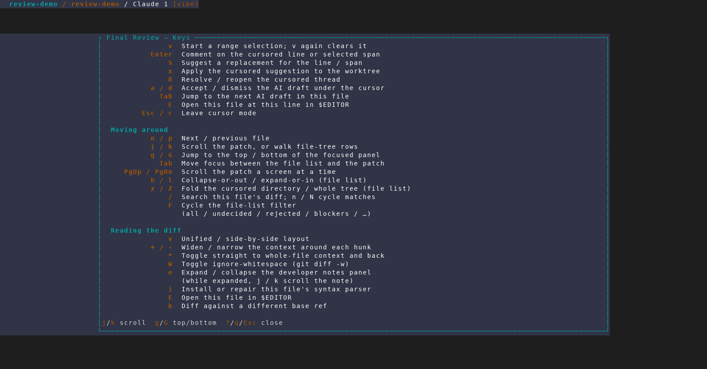
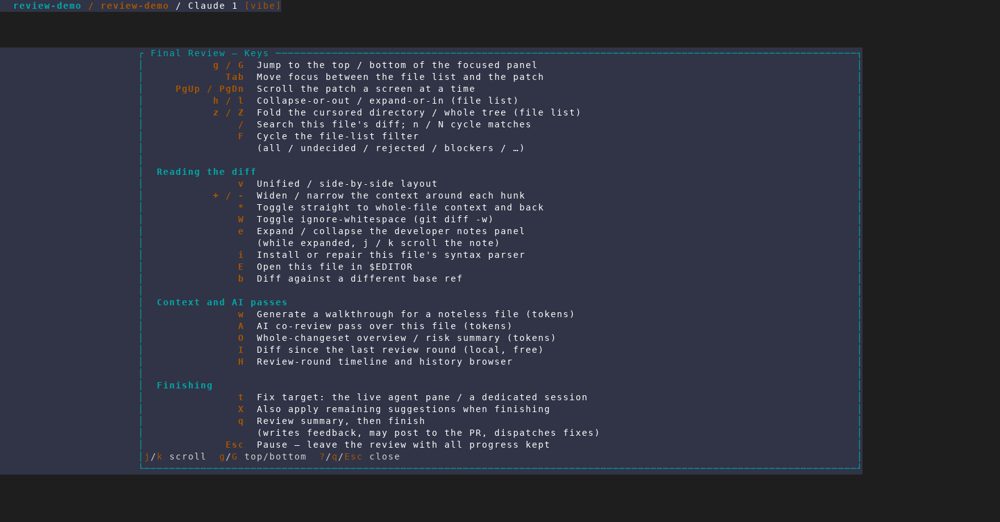
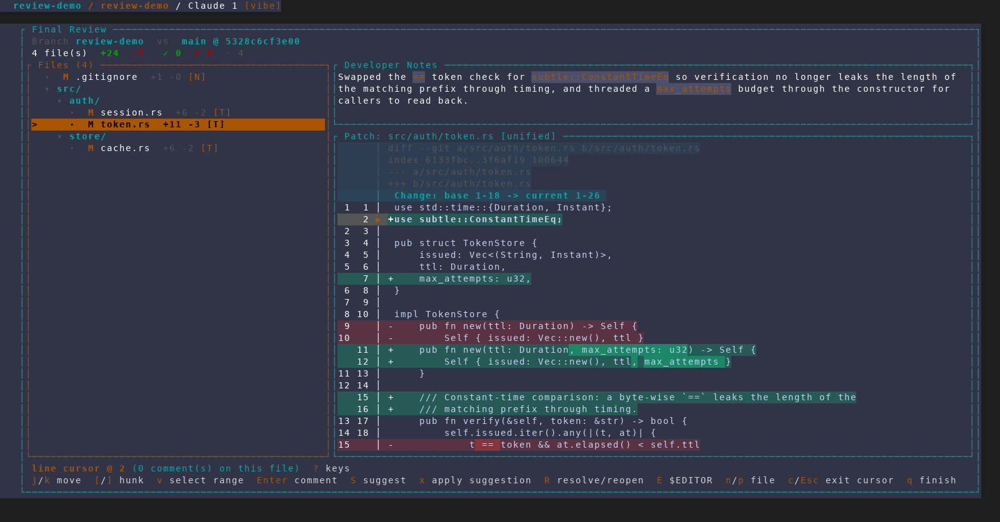
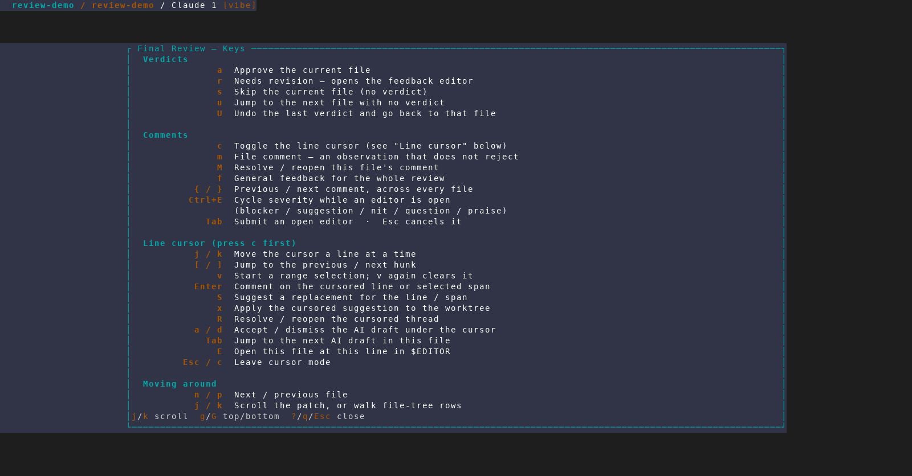

# `?` help overlay in Final Review

Captured from an isolated, throwaway AMF instance
(`scripts/dev/screenshot/amf-capture.sh`, 160x44, scenario
`scripts/dev/screenshot/scenarios/final-review-help-overlay.txt`) against a
scratch demo repo whose `review-demo` branch hardens token verification, bounds
a session's attempt budget and caps a cache, with matching developer notes in
`.claude/review-notes.md`. No real project, database or tmux session was
touched.

## 1. The review, and the one hint that is never conditional

`src/auth/token.rs` selected. The footer now leads with `? keys`.

This frame is also the argument for the feature: the footer's key row is long
enough that at 160 columns it **wraps into both footer rows**, so the second
row — `j/k scroll`, `b base ref`, `F filter`, `t target`, `q finish`,
`Esc pause` — is clipped off entirely and never rendered. The footer can only
ever teach the keys it has room for, which is why `? keys` leads the first line
rather than joining the second.

## 2. `?` — the whole key surface, grouped

Verdicts, Comments and Line cursor. The overlay takes full key precedence while
open, so the key pressed to dismiss it cannot also approve a file or start the
finish flow.

## 3. PageDown — Moving around

## 4. Reading the diff, Context and AI passes, Finishing

The passes that spend tokens (`w`, `A`, `O`) are labelled `(tokens)`, and `I` is
marked `(local, free)` — the distinction the footer has no room to make.

## 5. Cursor mode swaps which footer line is short

`c` activates the line cursor. Here the position label is the short line and the
*key* row is what wraps, so the hint rides the label instead — the mirror image
of frame 1, and the reason the placement is per-footer rather than one rule.

## 6. `?` is reachable from cursor mode too

The cursor-mode key block deliberately does not claim `?`, so the overlay is one
key away from anywhere in the review that is not already a text input or another
modal.

## Leaving the overlay changes nothing

Not shown as a frame, because there is nothing to see — which is the point. The
capture asserts it instead: the frame after `Esc` is **byte-identical** to the
frame before `?` in both cases (`003 == 007` at the top level, `008 == 010` in
cursor mode), so the round trip leaves the selected file, scroll offset and
cursor position exactly as they were.
