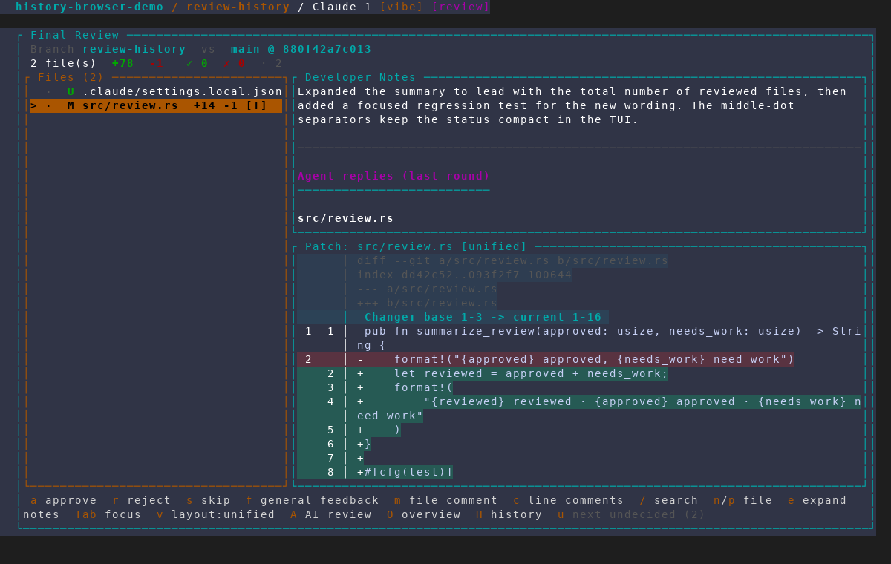
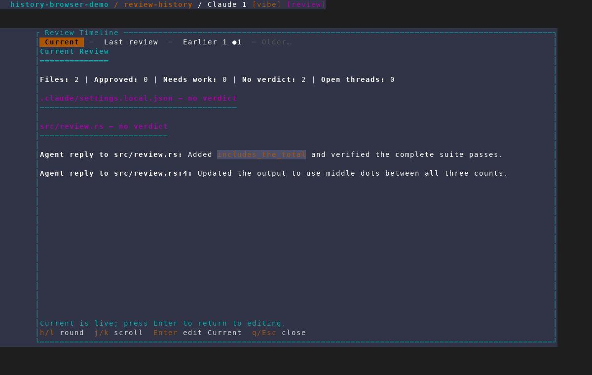
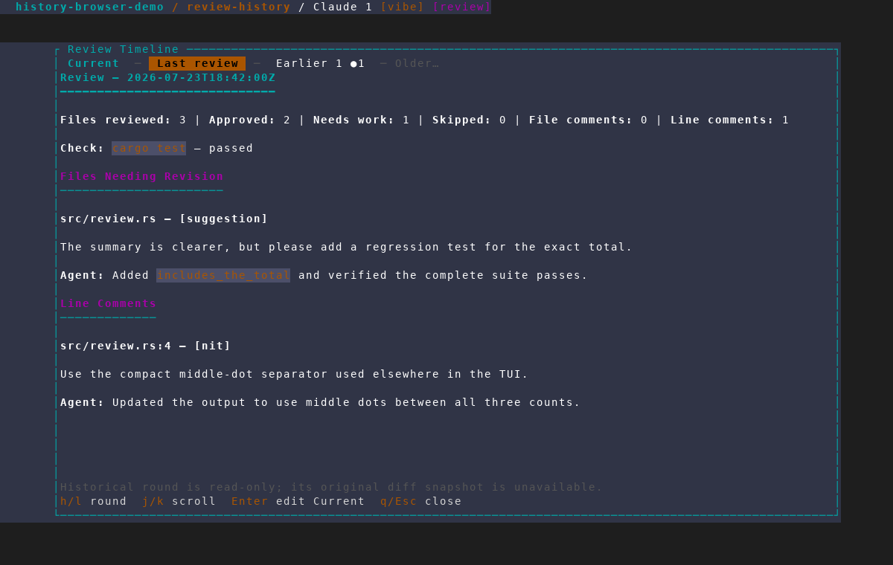
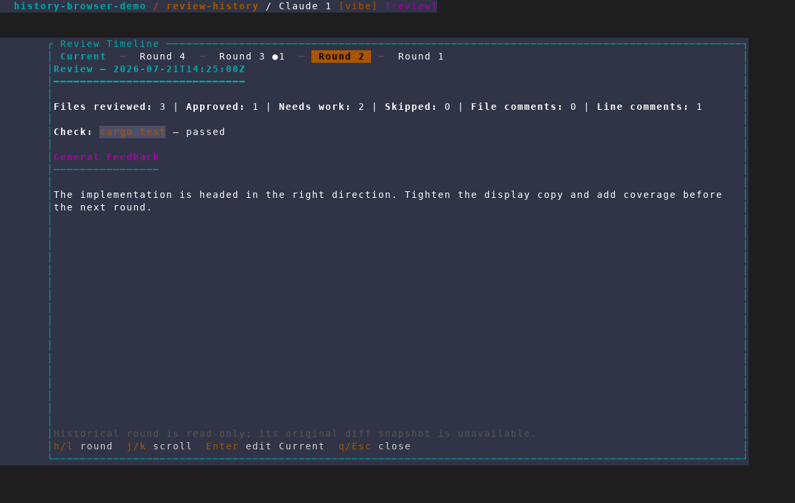

# Final Review history browser

Captured from an isolated AMF instance against a throwaway repository. The
fixture contains a real Rust diff, two recent review rounds, and two archived
rounds; it does not read or modify user projects or the normal AMF database.

## 1. History entry point

Final Review advertises `H history` alongside the live patch, developer notes,
and agent replies.

## 2. Current review

The timeline opens on `Current`, which is rendered from the live editable
review state.

## 3. Completed round

Finished rounds preserve checks, files needing revision, comments,
suggestions, and agent replies.

## 4. Lazy archive access

Navigating past the recent history loads archived rounds and renumbers the
combined newest-to-oldest timeline.

