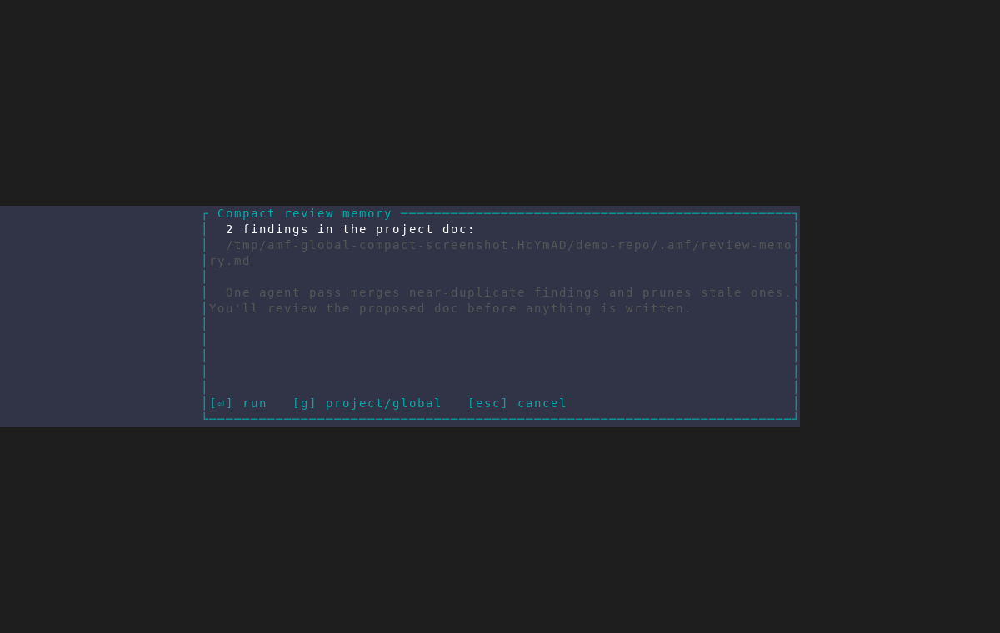
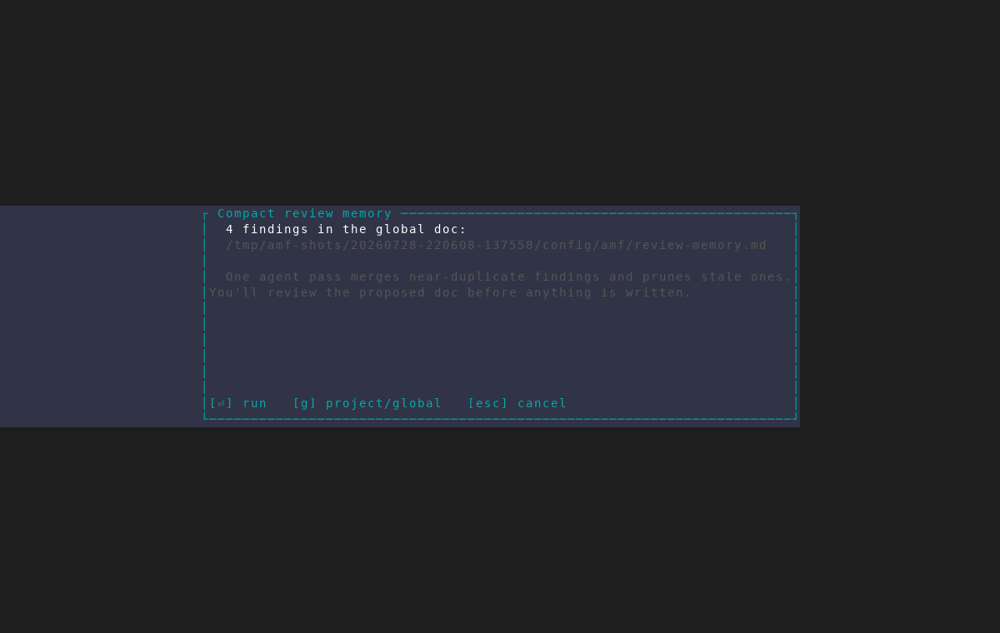

# Global review-memory compaction

Captured from an isolated AMF v0.33.0 instance with a two-finding project
memory doc and a four-finding cross-project memory doc. The capture stopped
before confirming the compact pass, so no agent tokens were spent and neither
document was written.

## 1. Project memory by default

When the project doc has findings, `c` opens the compact confirmation on that
doc. The dialog names the scope, resolved path, and current finding count.

## 2. Global memory after `g`

Pressing `g` switches to the cross-project doc and immediately refreshes both
the resolved path and its finding count.

