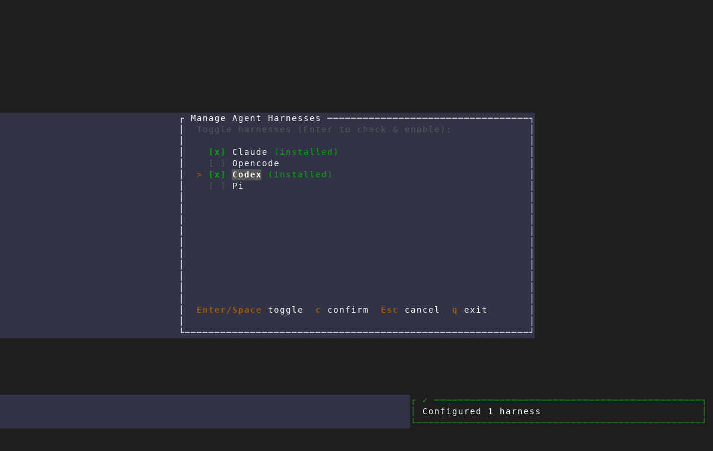
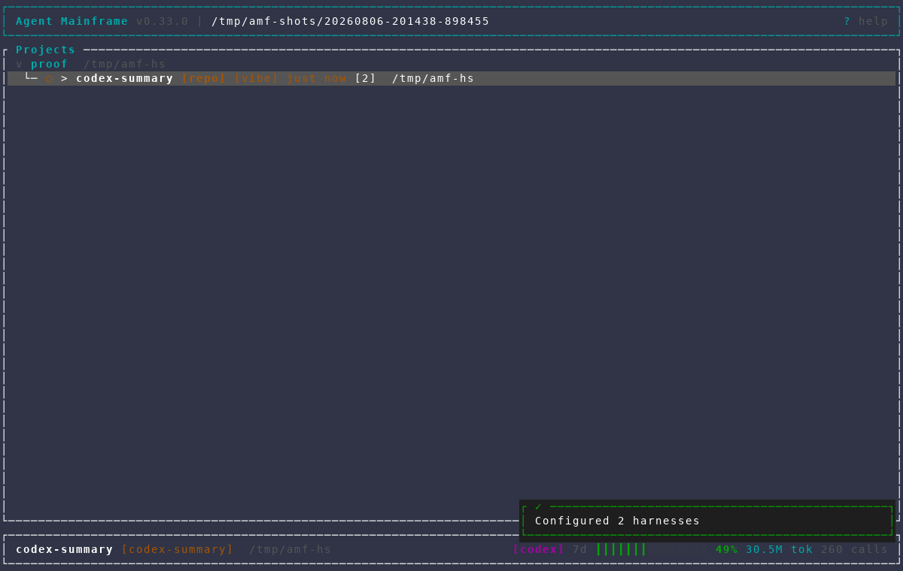
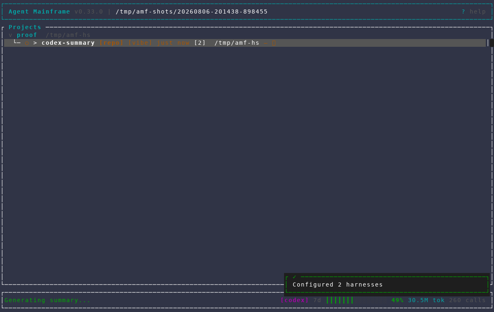
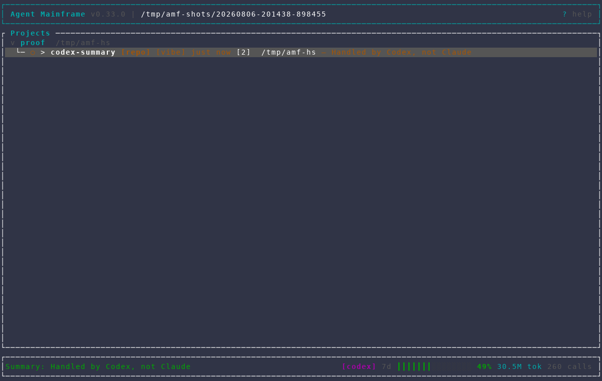

# Harness-aware session summaries

Captured with the repository's `/amf-screenshot` workflow from an isolated AMF
instance against a throwaway git repository. The capture fixture supplies a
deterministic fake `codex` executable for both the interactive feature session
and the restricted headless summary call; it does not contact a provider or
consume tokens.

This proves that AMF carries the selected Codex feature through the asynchronous
summary flow and displays Codex's result. The exact restricted command contract
and harness propagation are also covered by `summary::tests` and
`headless::tests`.

The reusable scenario is
`scripts/dev/screenshot/scenarios/harness-aware-session-summary.txt`. It expects
a create-project seed plus `SUMMARY_SHOT_SEED_FEATURE` pointing to a Codex
create-feature automation payload.

Open [gallery.html](gallery.html) to view the capture sequence.

## 1. Codex is enabled in the isolated workspace

The fixture passes AMF's real harness availability check before the feature is
created.

## 2. A Codex feature is selected for summarization

The dashboard status line identifies the selected feature's active harness as
Codex before the summary action begins.

## 3. Summary generation remains asynchronous

Pressing `Z` shows AMF's existing non-blocking generation state while the
headless runner works.

## 4. The Codex result lands on the feature

The completed feature row and status line show the deterministic result,
“Handled by Codex, not Claude,” while the status bar still identifies the
selected harness as Codex.

