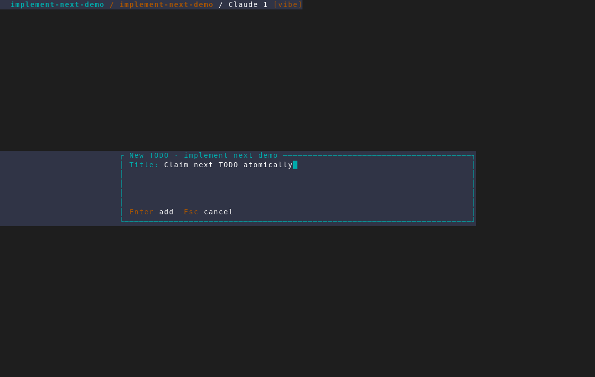
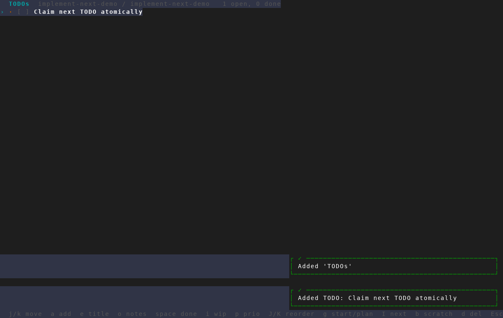

# Atomic Implement-next foundation

Captured from an isolated AMF database and tmux instance with
`scripts/dev/screenshot/amf-capture.sh` at the default `120x40` geometry.
The scenario creates a real TODO through quick capture, then opens the TODO
view so its `I next` entry point is visible.

This is proof of the current entry surface only. The branch increment captured
here defines the shared configuration state and claim outcomes; the new
harness/permission prompts and atomic SQLite claim are intentionally not shown
because they are still unchecked work in the feature plan.

## 1. Quick-capture a TODO

## 2. Open the TODO list

The created item appears in the native list, with `I next` in the footer.

