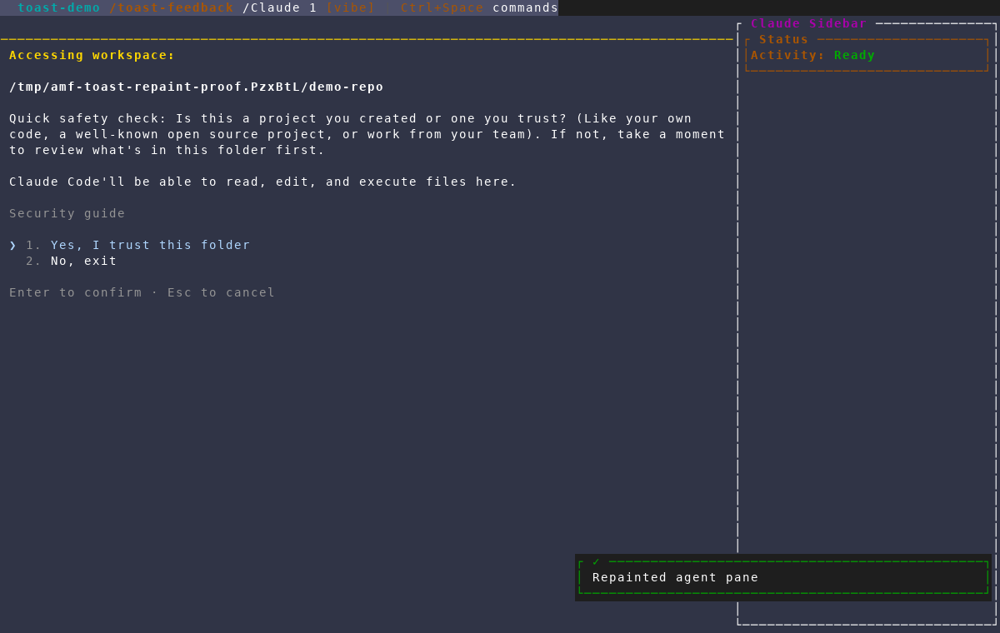
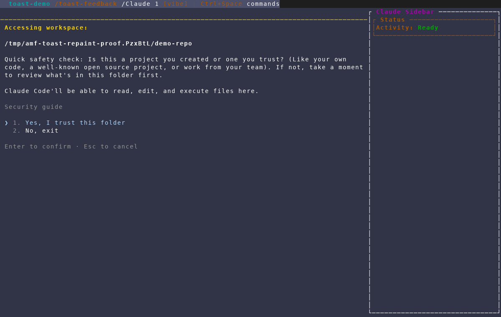

# Expiring feedback toasts in agent panes

Captured with the `/amf-screenshot` workflow from an isolated AMF instance
against a throwaway repository and Claude session. The scenario enters the
live harness, triggers the manual repaint with `Ctrl+Space` then `R`, and waits
past the success toast's three-second lifetime. It does not touch the user's
AMF database or existing tmux sessions.

## 1. Repaint feedback appears as a toast

The repaint confirmation is shown in AMF's standard toast area at the lower
right instead of being written over the harness at the bottom left. The same
promotion applies to any shared AMF status message that reaches pane view.

## 2. The toast clears automatically

After the toast expires, AMF redraws the pane without leaving the confirmation
or stale cells behind. The bottom-left harness area remains unobstructed.

