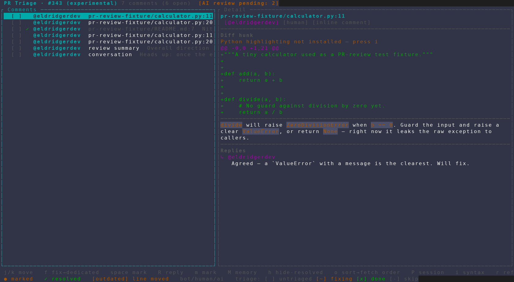
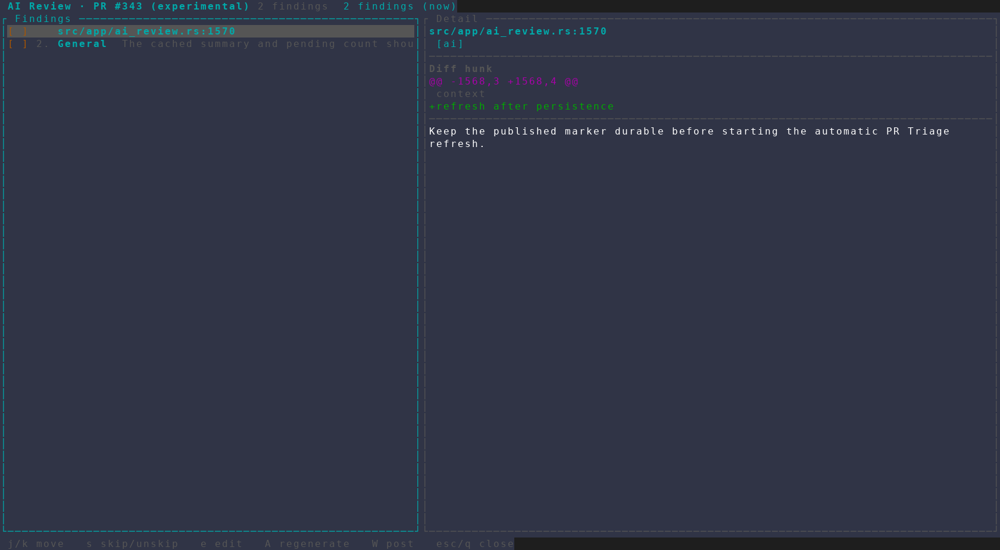
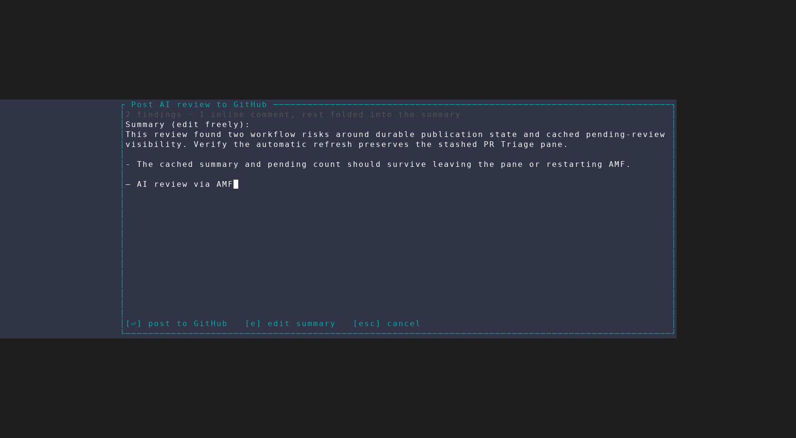

# Pending AI Review in PR Triage

Captured from an isolated AMF instance against the read-only PR-review test
fixture (#343). The AI Review cache contained two representative unpublished
findings; the capture stopped before confirming `W`, so it did not write to
GitHub.

## 1. Pending review signal

PR Triage shows the persisted number of findings that can still be published.

## 2. Cached review

Pressing `A` restores the completed AI Review and its findings without running
the model again.

## 3. Editable GitHub review

Pressing `W` seeds the existing confirmation editor with the generated summary,
folds general findings into the body, and adds AMF attribution.

After a successful post, AMF marks the included findings as published and
refreshes the stashed PR Triage pane automatically. That final write was not
performed for this artifact.
