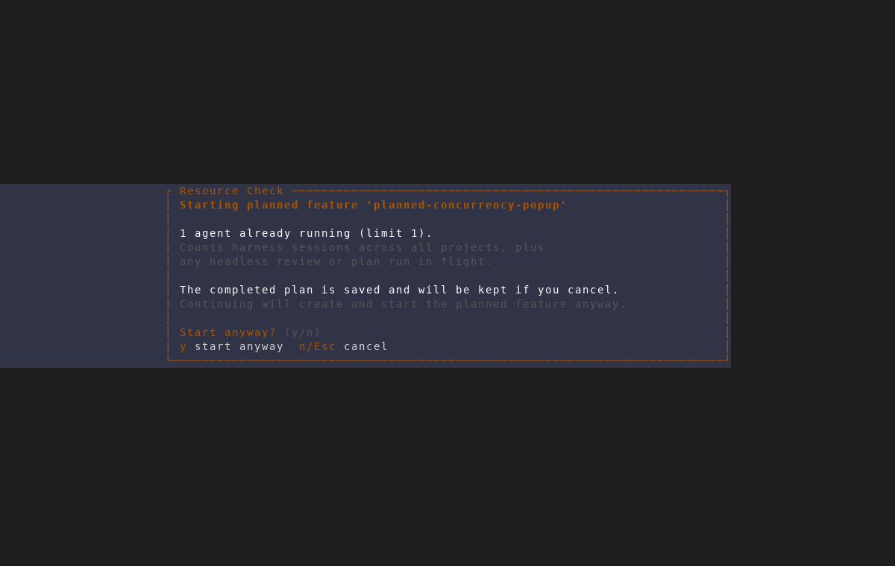

# Plan completion concurrency confirmation

Captured from an isolated AMF screenshot instance at 120×40 with one Claude
session running and `max_concurrent_agents` set to 1. The plan review was
seeded with completed markdown so the capture used no headless-agent tokens;
the scratch database, repository, worktree, and tmux sessions were isolated
from the user's AMF state and the spawned sessions were removed afterward.

Accepting the completed plan opens Resource Check immediately. The dialog
names the planned feature, explains that the plan is saved and retained on
cancel, and keeps the established `y`/Enter and `n`/Esc controls.

