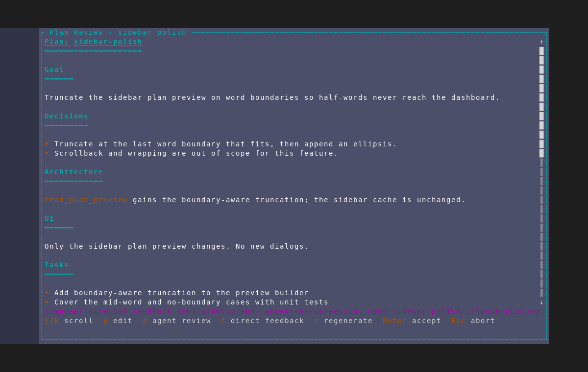
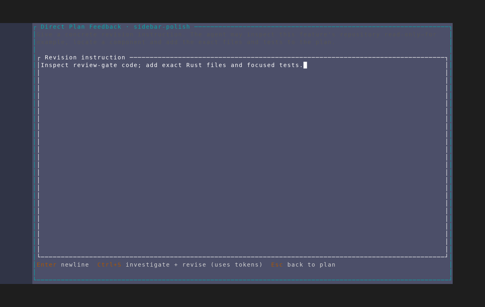

# Directed feedback at the plan review gate

Captured from an isolated AMF instance against a throwaway repository using
`scripts/dev/screenshot/scenarios/plan-interview-directed-feedback.txt`.
The fixture seeds a draft that already contains a synthesized plan, so reaching
the review gate costs no agent tokens. It stops before submitting the feedback
for the same reason.

## 1. Review-gate action

The plan review footer now includes `f direct feedback` alongside edit, agent
review, regenerate, accept, and abort.

## 2. Free-form, repository-aware instruction

Pressing `f` opens a multi-line editor. Its copy explains that the agent may
inspect the feature repository read-only, while the footer makes the token cost
and `Ctrl+S` submission action explicit. `Esc` returns to the unchanged plan.

