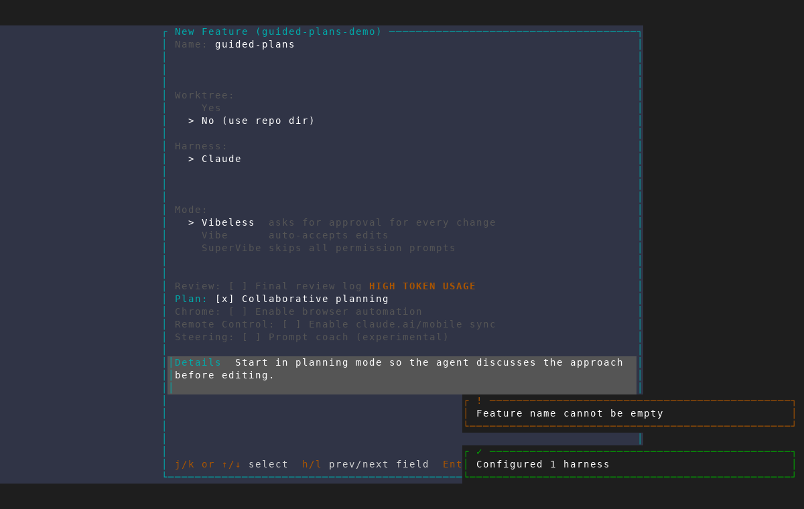
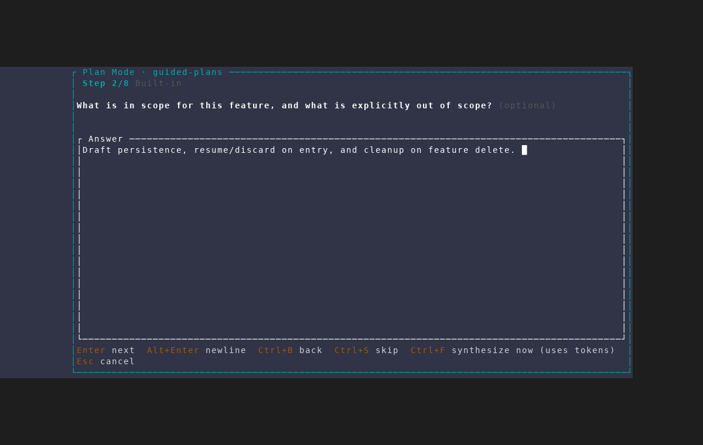
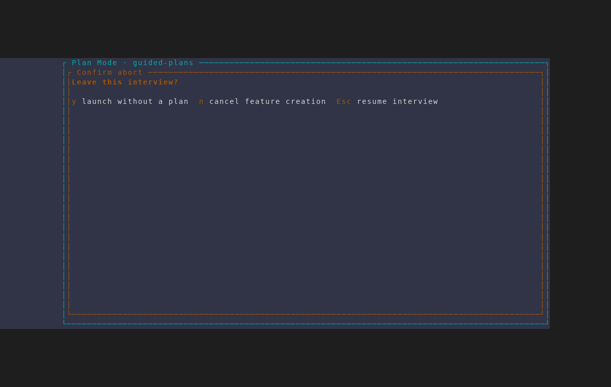
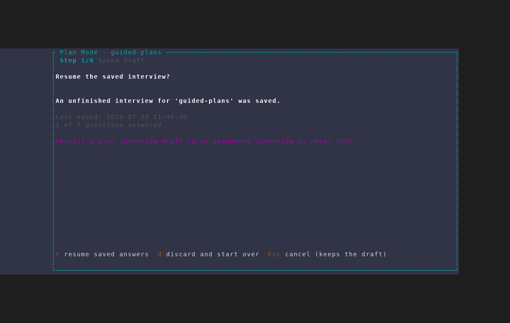
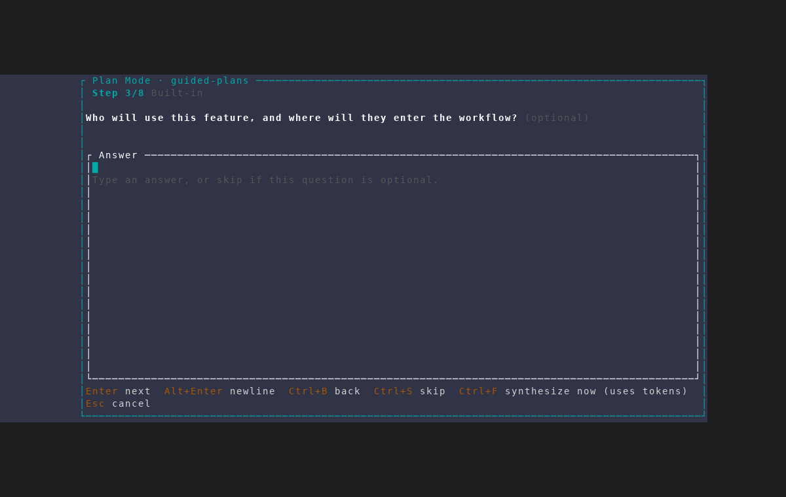
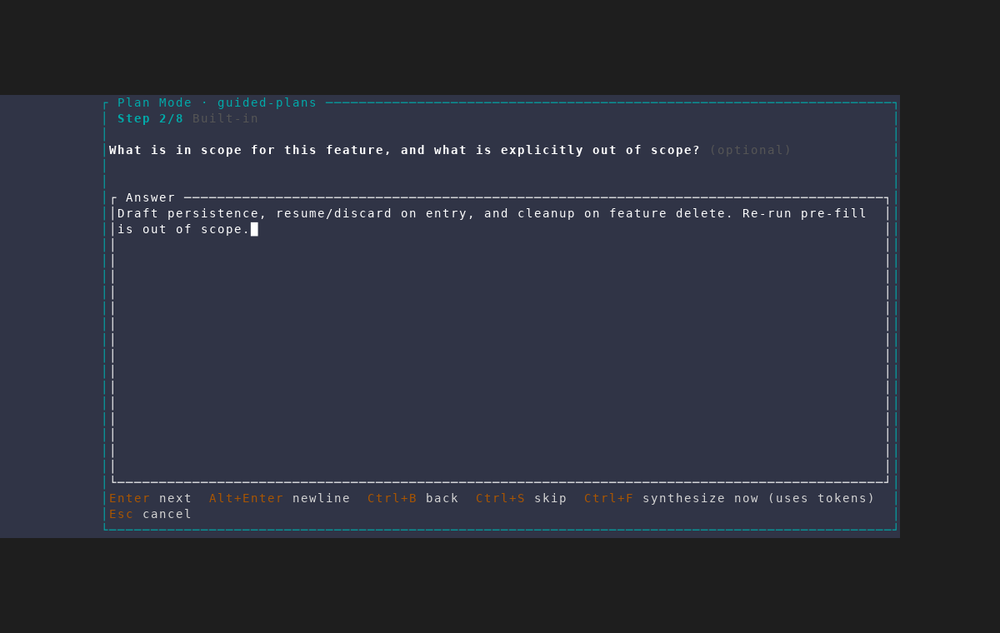

# Plan-mode interview draft persistence

Captured with the `/amf-screenshot` workflow from an isolated AMF instance
against a throwaway repository, using
`scripts/dev/screenshot/scenarios/plan-interview-resume.txt`. The scenario
answers part of a plan-mode interview, abandons it, then re-creates the same
feature — so it exercises the real draft round-trip without reading or
modifying user projects, the normal AMF database, or any agent session. Plan
mode defers the feature launch and every pass aborts before accepting, so no
feature is created and no agent starts.

## 1. Plan mode turns feature creation into an interview

Ticking **Collaborative planning** on the wizard's Mode step routes creation
into the discovery interview instead of launching immediately.

## 2. Answers are saved as they are given

The draft row is written once the brief exists, then re-saved after every
action that records something — an answer, a skip, `Ctrl+B` back, finish-early,
a completed AI round, a synthesized plan, a plan edit.

## 3. Both exits keep the draft

`Esc` asks how to leave the interview. Launching without a plan and cancelling
the feature outright both preserve the saved answers.

## 4. Re-entry offers the saved draft

Creating the same feature again opens on `PlanInterviewPhase::ResumePrompt`
rather than a blank brief. The frame summarises what resuming would restore —
last-saved time, how many questions were answered, spent AI rounds, whether a
plan was already generated, and the brief itself. `r` resumes, `d` discards and
deletes the row, `Esc` keeps it. Nothing is restored until the user chooses.

The draft is keyed `pending:<project>/<branch>`, because a feature-creation
interview runs before the feature and its uuid exist.

## 5. Resuming lands on the first unanswered question

Not back at the start, and not at the end of the answered run. Answers are
matched by question **id** rather than position, since a project's
`plan_questions` config can change the bank between runs.

## 6. Prior answers are restored, not re-typed

`Ctrl+B` steps back to show the answer given before the interview was
abandoned, read back from SQLite.

