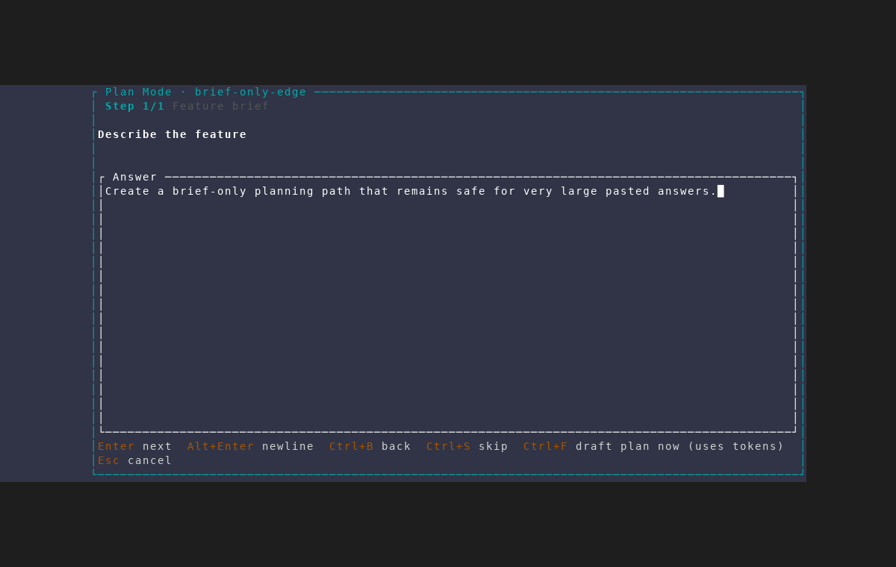
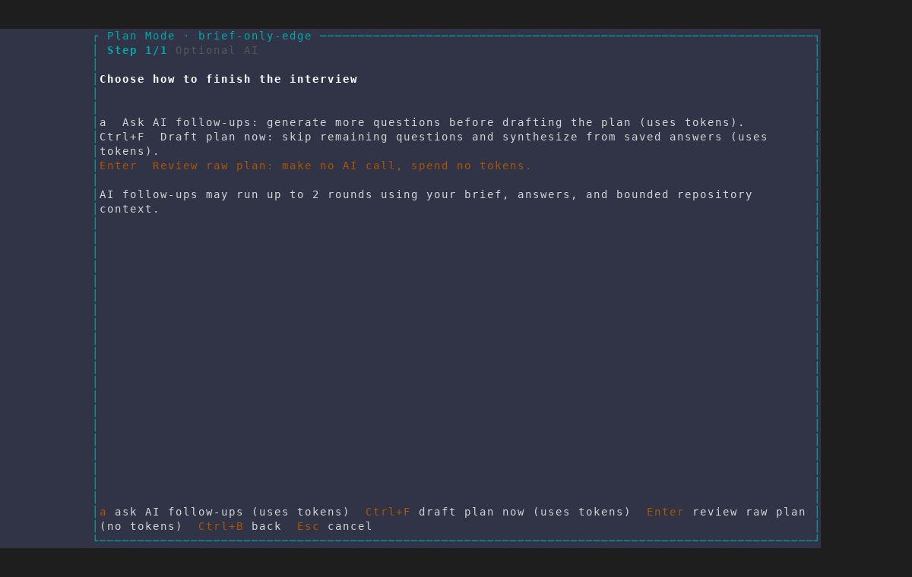
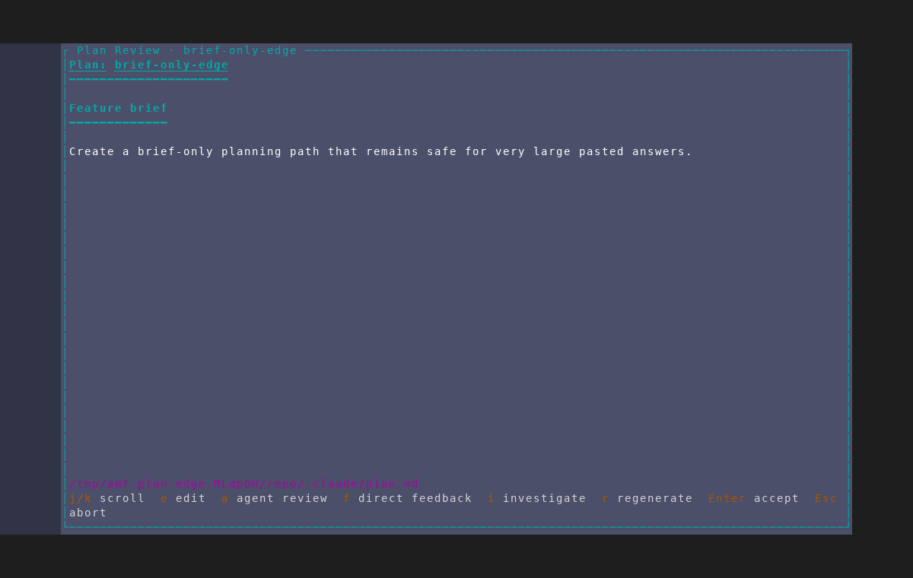
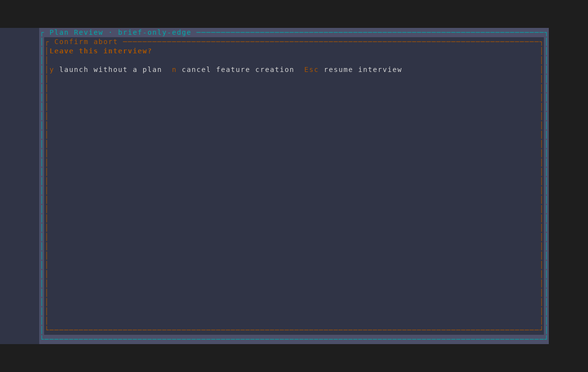

# Plan-mode empty and edge handling

Captured with the repository's `/amf-screenshot` workflow from an isolated AMF
instance against a throwaway git repository. That repository's
`.amf/config.json` sets `skip_builtin_questions: true` with no configured
questions, so the feature brief is the entire static interview.

The reusable scenario is
`scripts/dev/screenshot/scenarios/plan-interview-edge-handling.txt`. Run it with
`scripts/dev/screenshot/amf-capture.sh --scenario <scenario> --seed <seed>`,
where the create-project seed points at a throwaway repository containing:

```json
{
  "skip_builtin_questions": true,
  "plan_questions": []
}
```

The scenario takes the no-token raw-plan route and aborts before accepting, so
it creates no feature and launches no agent session.

## 1. A zero-question interview is still a valid flow

The required feature brief is shown as `Step 1/1`. `Ctrl+F` remains available
right here as the direct “draft plan now” path, so a user can synthesize from
the brief without visiting a placeholder question.



## 2. Completion follows the brief immediately

Submitting the brief moves directly to the finishing choice. There is no empty
question frame between them. The dialog distinguishes AI follow-ups, direct
synthesis, and the zero-token raw-plan review.



## 3. The deterministic fallback is genuinely brief-only

Choosing the no-token path opens a review containing the feature brief and no
empty `Q&A` heading or skipped-question placeholders.



## 4. The flow remains safely abortable

The ordinary deferred-launch confirmation remains available from review; this
capture cancels feature creation without writing or launching anything.



Large-answer bounding occurs at the headless prompt boundary and has no honest
visual state to capture. Its regression uses multi-byte Unicode input to prove
that the model copy is bounded without splitting a character, while the saved
transcript and raw-plan fallback retain the complete answer.
