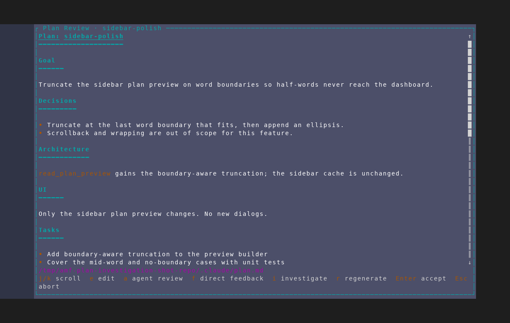
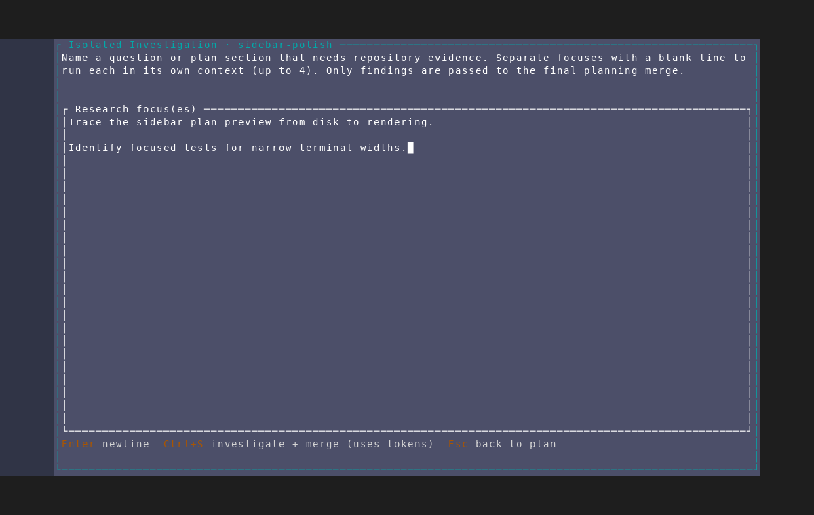

# Isolated investigation at the plan review gate

Captured from an isolated AMF instance against a throwaway repository using
`scripts/dev/screenshot/scenarios/plan-interview-isolated-investigation.txt`.
The fixture seeds a draft that already contains a synthesized plan, so reaching
the review gate costs no agent tokens. It stops before submitting the research
focuses for the same reason.

## 1. Review-gate action

The plan review footer includes `i investigate` alongside edit, agent review,
direct feedback, regenerate, accept, and abort.

## 2. Context-isolated research focuses

Pressing `i` opens a multi-line editor. Blank-line-separated focuses run in
separate read-only contexts (up to four), and the copy states that only their
findings reach the final planning merge. The footer makes the token cost and
`Ctrl+S` submission action explicit; `Esc` returns to the unchanged plan.

