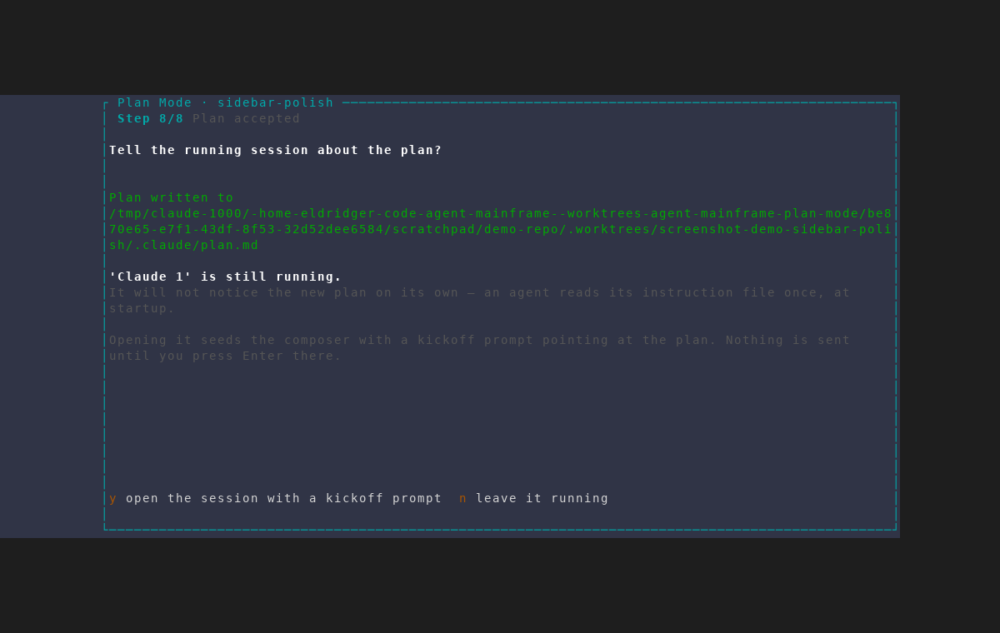
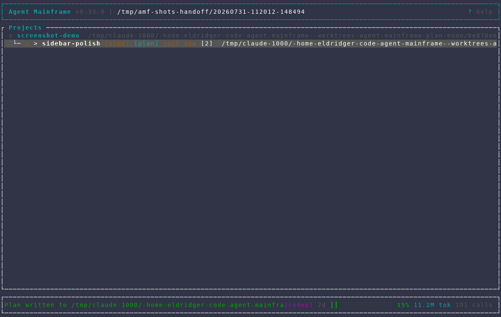
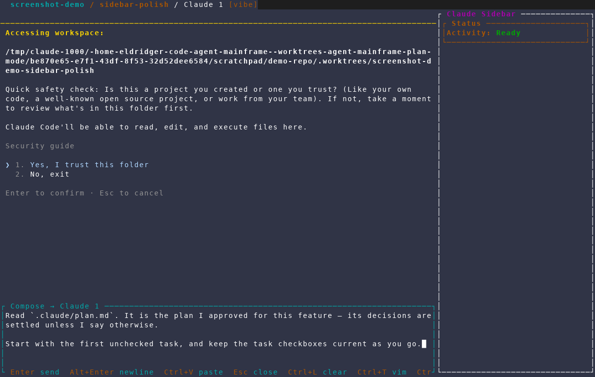

# Handing an accepted plan to a running session

Captured from an isolated AMF instance against a throwaway repository, using
`scripts/dev/screenshot/scenarios/plan-interview-live-handoff.txt`. The
scenario seeds a project and one feature — which launches a real claude
session, exactly what the handoff needs — then accepts an on-demand plan for
that feature while its session is still running.

Reaching the handoff means **accepting** a plan, which normally runs a real
headless synthesis call: tokens, non-deterministic markdown, and several
seconds of loading frame. The capture sidesteps that the way the re-run capture
does. A `draft`-stage row that already carries a generated plan reopens
straight at the review gate instead of synthesizing again, so
`scripts/dev/screenshot/seed_plan_draft.py` writes one into the scratch
database and the scenario resumes it. `Enter` at that gate accepts a plan that
cost nothing.

Two passes, because an accept consumes the draft it resumed: the first
declines the handoff, the second takes it. Both re-seed the draft first.

## 1. The offer

A running agent read its instruction file once, at startup. A plan written
underneath it therefore goes unnoticed until something says so — which is what
this prompt is for.

The offer leads with **Plan written to …** deliberately. The accept has already
fully landed by this point (plan file, instruction block, `plan_mode` on, and
the `[plan]` badge), so declining costs nothing; the only thing actually on
offer is interrupting a session that may be mid-task.

## 2. Declining leaves the session alone

`n` (or `Esc`) returns to the dashboard. The status line still says where the
plan was written, and the feature carries its new `[plan]` badge — the running
session is simply not typed into.

## 3. Taking it seeds the composer

`y` opens the running session and seeds its composer with the same kickoff
prompt a freshly launched session gets: **seeded, not sent**. The session may
be mid-task, so when the prompt lands stays the user's call — the same contract
every other compose seed in AMF has.

The pane behind the composer shows Claude Code's first-run trust prompt, which
is an artifact of the throwaway worktree the capture creates, not of the
handoff.

