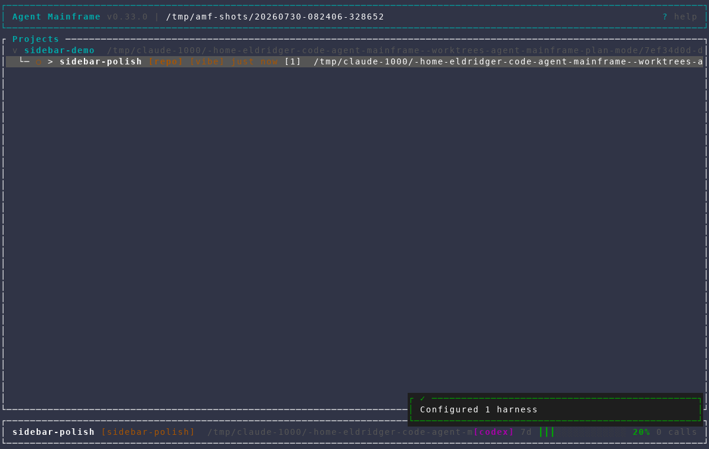
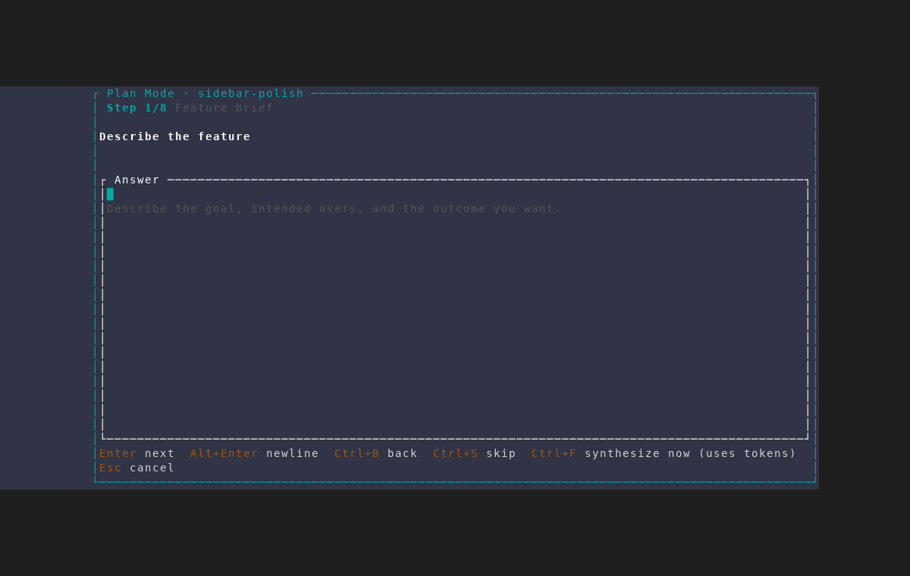
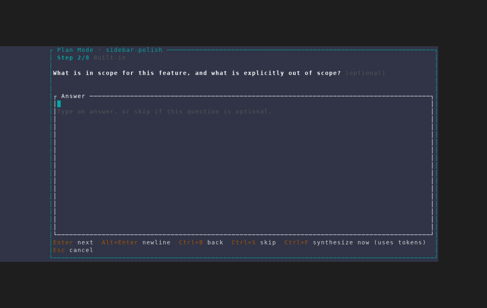
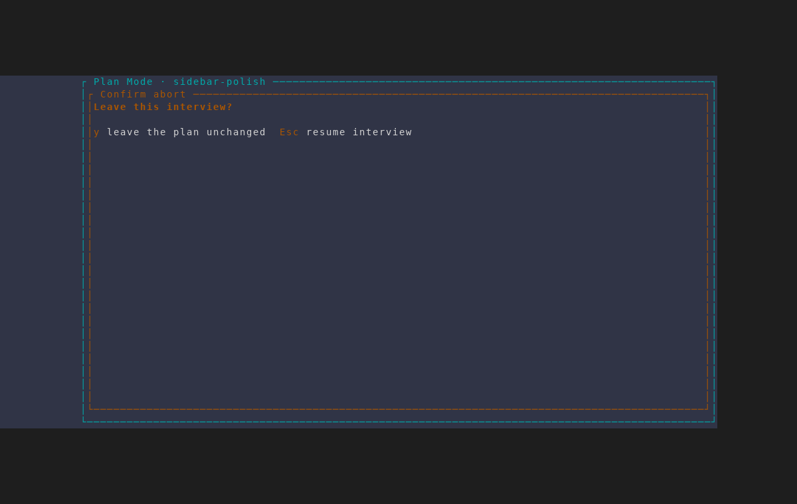
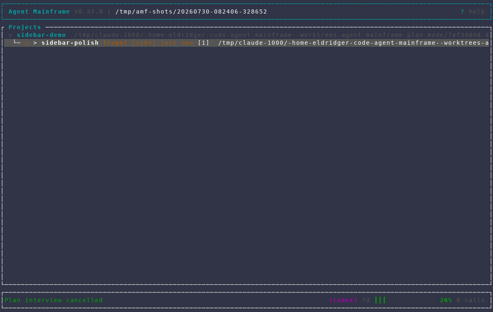
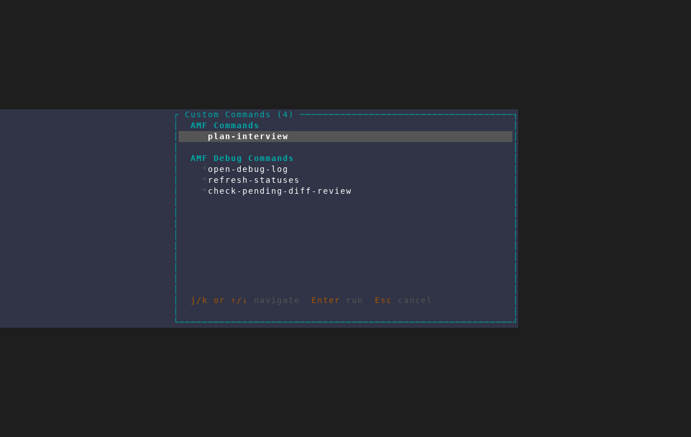

# On-demand plan interviews

Captured with the `/amf-screenshot` workflow from an isolated AMF instance
against a throwaway repository, using
`scripts/dev/screenshot/scenarios/plan-interview-on-demand.txt`. The scenario
seeds a project and one feature with **plan mode off**, then runs the
interview against that existing feature — so it exercises the real
no-pending-launch path without reading or modifying user projects, the normal
AMF database, or any agent session.

Every pass aborts before accepting. Accepting runs a real headless synthesis
call against the feature's harness, which costs tokens and would make the
capture slow and non-deterministic; the accept path is covered by unit tests
instead (`accepting_an_on_demand_plan_writes_it_into_the_features_own_workdir`).

## 1. The trigger needs a feature selected

The interview plans one feature's workdir, so `P` (and the command-picker
entry) are only meaningful with a feature or session row selected. The feature
here has no plan and no `[plan]` badge.

## 2. `P` opens the interview for the feature that already exists

No wizard and no deferred launch — the title names the existing feature and the
interview starts on the same feature brief the creation-triggered flow uses.
The state machine is shared; only the launch is absent.

## 3. Questions are the project's normal bank

Built-in questions merged with any `plan_questions` the project configures,
identical to the creation-triggered interview.

## 4. Aborting has no feature to cancel

The distinguishing frame. A creation-triggered interview offers
`y launch without a plan` / `n cancel feature creation` here; an on-demand one
has neither, so the confirm offers only **`y` leave the plan unchanged** and
**`Esc` resume interview**. `n` is inert rather than falling through to a
handler that would exit the interview anyway.

## 5. Leaving is non-destructive

The feature keeps whatever plan it had — here, none. No `[plan]` badge appears,
nothing is written, and the feature is untouched.

## 6. The second trigger

`Ctrl+Space` then `a` opens the command picker focused on AMF's own local
commands, where `plan-interview` is listed under the **AMF** source. It is
offered only when a feature or session is selected.

