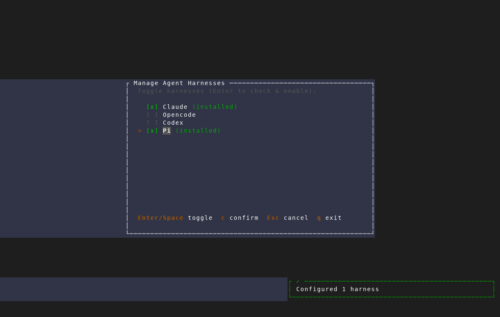
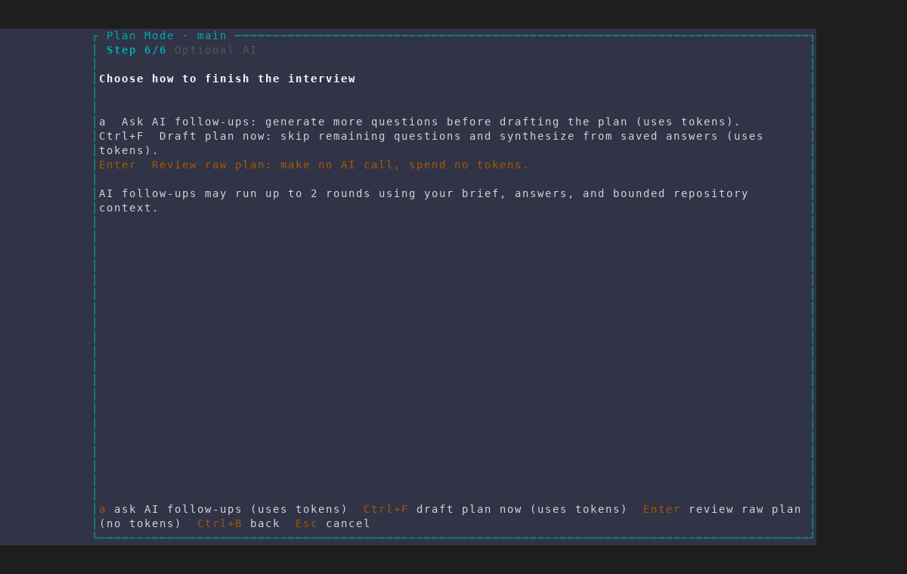
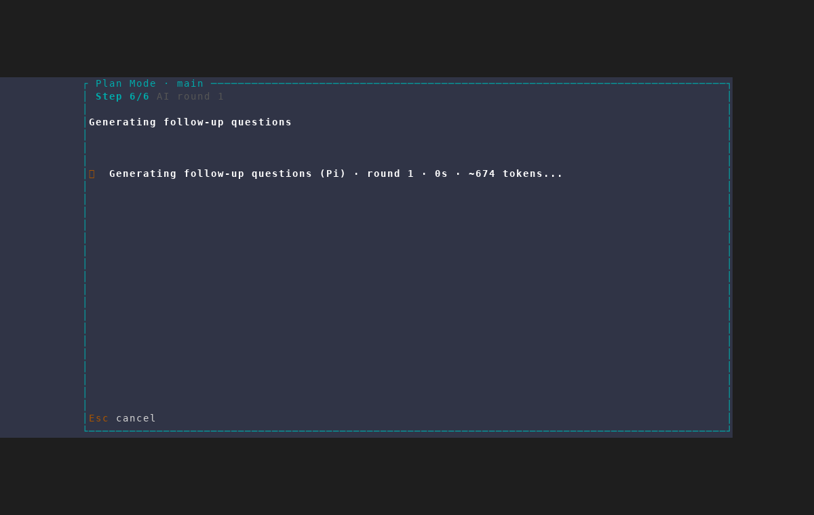

# Pi-powered plan interviews

Captured with the repository's `/amf-screenshot` workflow from an isolated AMF
instance against a throwaway git repository. The fixture supplies a deterministic
fake `pi` executable that advertises the official safe-headless flags and pauses
during the paid-call boundary; it does not contact a provider or consume tokens.
This proves AMF's availability probe and harness selection, while the command
assembly and isolation flags remain covered by `headless::tests`.

The reusable scenario is
`scripts/dev/screenshot/scenarios/plan-interview-pi-headless.txt`. It expects a
create-project seed plus `PI_SHOT_SEED_FEATURE` pointing to a Pi create-feature
automation payload. The scratch harness manager enables Pi before the feature is
created, matching a real configured workspace.

Open [gallery.html](gallery.html) to view the complete capture sequence.

## 1. Pi passes AMF's harness check

The isolated fixture appears as an installed Pi harness. The fixture's `--help`
contains the complete print, ephemeral-session, no-tools, read-only allowlist,
resource-isolation, project-trust, and model-selection contract required by the
new runtime probe.

## 2. The interview still presents explicit token choices

The existing review gate remains unchanged: users choose AI follow-ups, direct
synthesis, or the no-token raw plan. The capture takes the follow-up route.

## 3. Pi powers the headless plan call

After opting in, AMF's native loading frame names Pi as the selected engine.
This is the visible behavior added by the feature; older Pi versions missing any
required safety flag fall back before reaching this frame.

