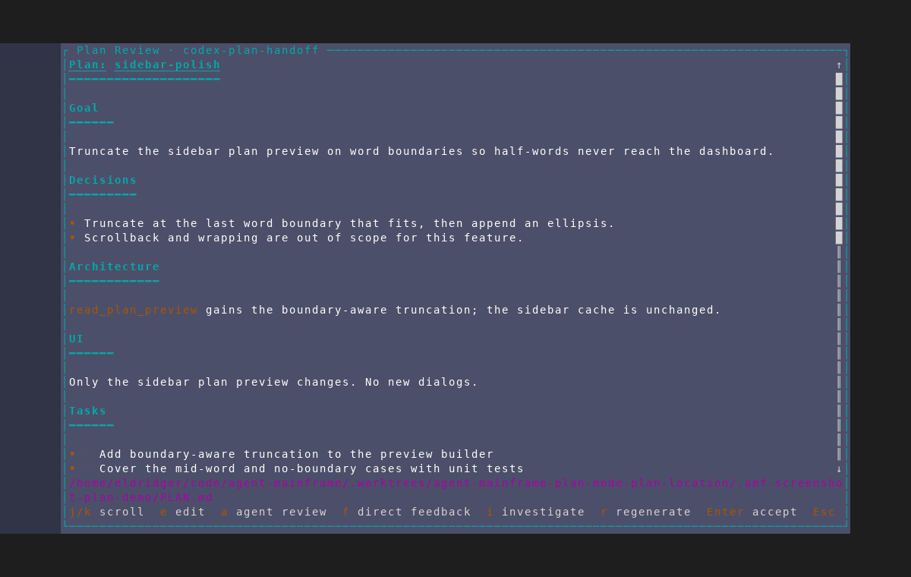
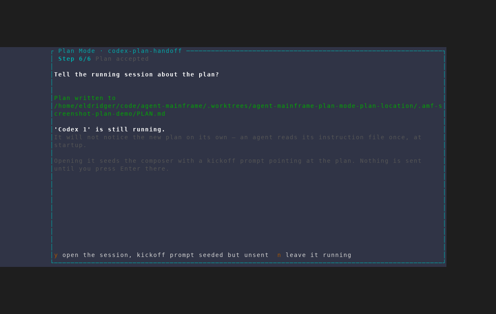
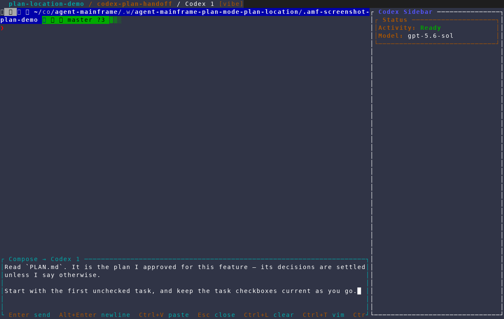

# Root plan location and Codex kickoff

Captured with the `/amf-screenshot` workflow from an isolated AMF instance
against a throwaway repository, using
`scripts/dev/screenshot/scenarios/plan-mode-plan-location.txt`. The scenario
uses a seeded draft at the review gate, accepts it without spending model
tokens, and opens an already-running Codex session.

The capture output directory was
`docs/screenshots/plan-mode-plan-location/`; ANSI frames were rendered at
120x40 and their text twins were checked before selecting these frames.

## 1. Review points at the feature-root plan

The accepted plan review identifies `PLAN.md` in the feature workdir rather
than the Claude-specific `.claude/plan.md` path.

## 2. Acceptance offers the running-session handoff

AMF confirms that the plan was written to the feature-root `PLAN.md` and
explains that opening the live Codex session will seed, but not submit, a
kickoff prompt.

## 3. Codex receives the kickoff prompt

Choosing the handoff opens `Codex 1` with the shared kickoff prompt already in
AMF's composer. The prompt tells Codex to read `PLAN.md` and begin with its
first unchecked task; Enter remains under the user's control.

