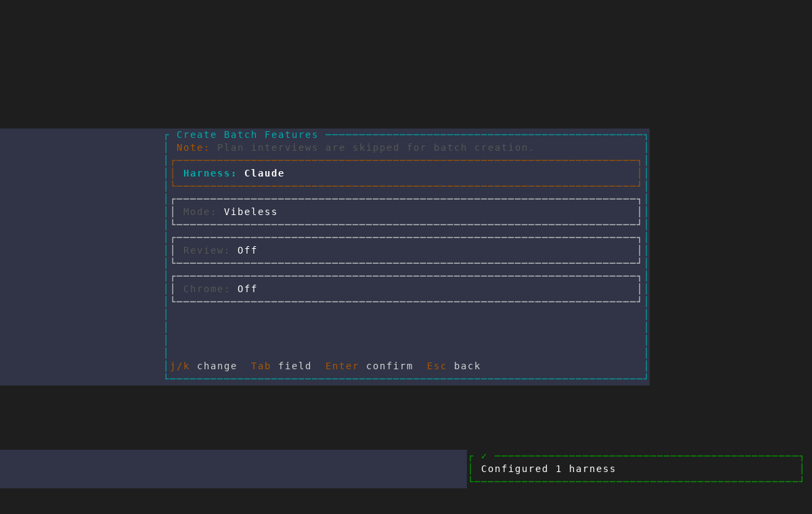

# Plan-mode preset and batch interplay

Captured from an isolated AMF instance with
`scripts/dev/screenshot/scenarios/plan-mode-preset-batch.txt`. The scenario
walks to the final batch settings screen, captures it, and exits without
creating any features.

## Batch interview notice

Batch creation intentionally skips plan interviews instead of opening one
interview per fan-out feature. The settings screen now makes that behavior
explicit before confirmation. Plan-mode presets still enter the interview in
the single-feature flow, covered by the feature-creation regression test.

