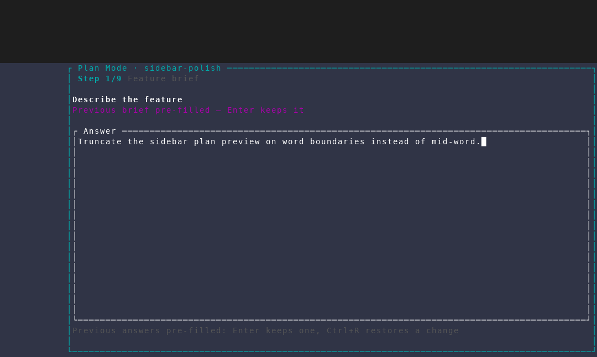
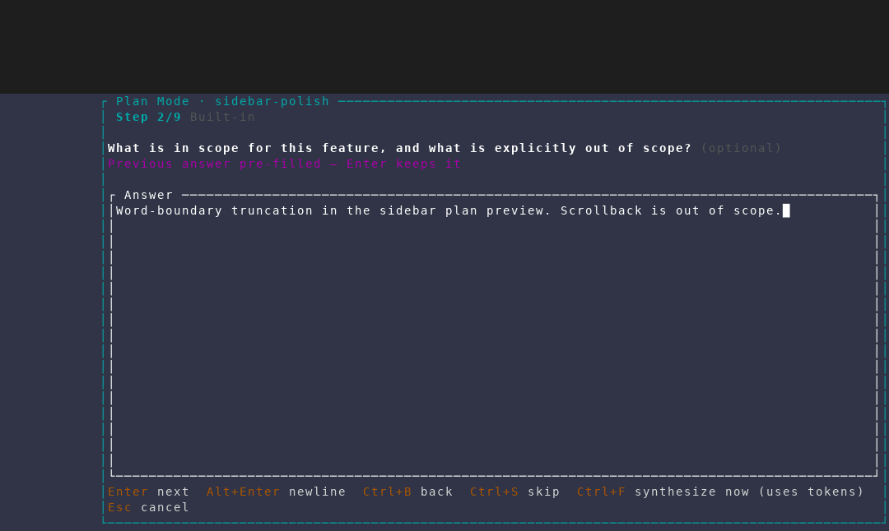
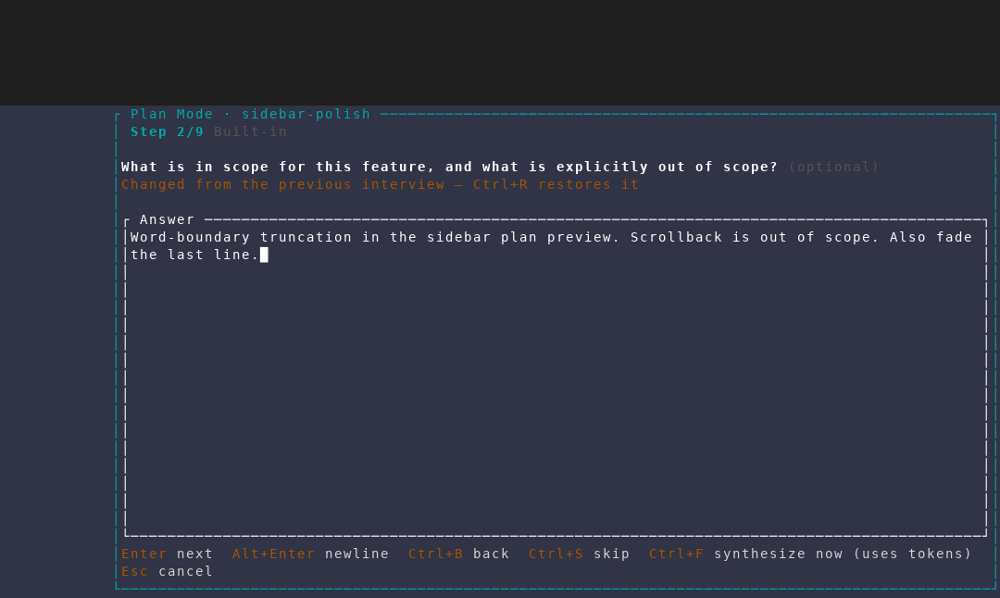
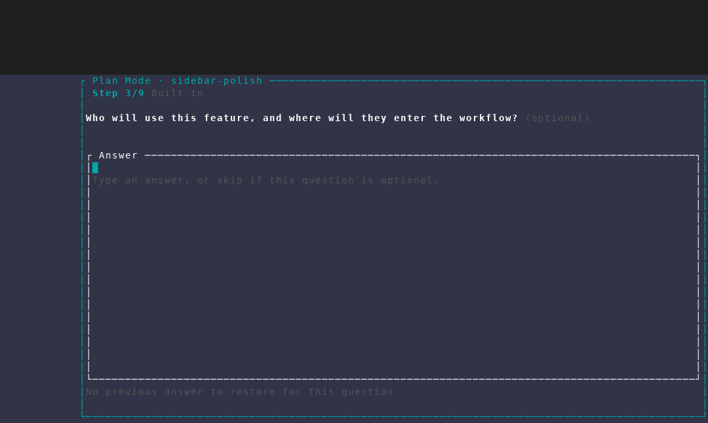
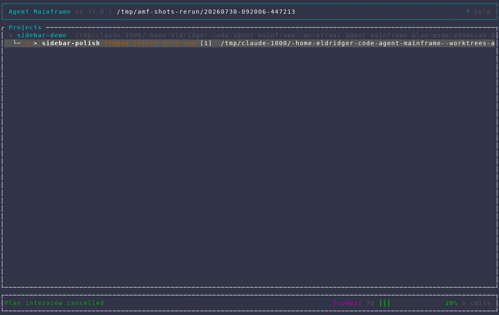

# Re-running a plan interview

Captured from an isolated AMF instance against a throwaway repository, using
`scripts/dev/screenshot/scenarios/plan-interview-rerun.txt`. The scenario seeds
a project and one feature, then runs the interview on that feature a **second**
time — so every question arrives carrying the answer behind the plan already
accepted for it.

A re-run needs a previously accepted interview to read, and accepting one runs
a real headless synthesis call (tokens, and non-deterministic output). The
capture therefore writes that `final`-stage row straight into the scratch
database during the scenario's opening `wait`, keyed by the seeded feature's
id:

```python
python3 - "$(ls /tmp/amf-shots-rerun/*/config/amf/amf.db)" <<'PY'
import json, sqlite3, sys

conn = sqlite3.connect(sys.argv[1])
feature_id, feature_name = conn.execute("SELECT id, name FROM features").fetchone()
questions = [
    {"id": "scope",
     "text": "What is in scope for this feature, and what is explicitly out of scope?",
     "kind": "free_text", "source": "builtin", "optional": True},
    {"id": "truncation-strategy",
     "text": "Where should the preview truncate when a plan line overflows?",
     "kind": {"select": ["At the last word boundary that fits",
                         "Hard character cut with an ellipsis"]},
     "source": {"ai": {"round": 1}}, "optional": True},
]
answers = ["Word-boundary truncation in the sidebar plan preview. Scrollback is out of scope.",
           "At the last word boundary that fits"]
conn.execute(
    """INSERT INTO plan_interviews
        (feature_id, stage, feature_name, brief, questions, answers, plan,
         ai_rounds_completed, created_at, updated_at)
       VALUES (?, 'final', ?, ?, ?, ?, ?, 1, datetime('now'), datetime('now'))""",
    (feature_id, feature_name,
     "Truncate the sidebar plan preview on word boundaries instead of mid-word.",
     json.dumps(questions), json.dumps(answers),
     "# Plan: sidebar-polish\n\n## Goal\nReadable plan previews.\n"))
conn.commit()
PY
```

The transcript deliberately contains one built-in question the current bank
still asks and one AI follow-up it cannot contain, so the capture also shows
the paid-for AI question being carried into the re-run (the step counter reads
`/9`: the brief, seven built-in questions, and that carried one).

Every pass aborts before accepting, like the on-demand capture; the accept path
is covered by unit tests.

## 1. The brief starts from the accepted interview

`P` on the feature opens the interview with the previous brief already in the
editor, so `Enter` keeps it. Nothing has to be retyped to re-plan a feature.



## 2. Each question arrives pre-filled

The first question carries its previously accepted answer, and the note under
it says so: **Previous answer pre-filled — Enter keeps it**. Answers are matched
by question **id**, not position, so editing the project's `plan_questions`
between runs cannot map an answer onto the wrong question.



## 3. Typing changes it

Editing switches the note to **Changed from the previous interview — Ctrl+R
restores it**, in the warning colour: the interview says plainly which answers
this run has moved away from.



## 4. `Ctrl+R` restores it

The previously accepted answer comes back verbatim, and the note returns to
"pre-filled". Changing one's mind about a change costs one keypress.


## 5. Questions with no history are untouched

The next built-in question was never answered before, so it arrives empty with
no note. `Ctrl+R` there has nothing to restore and says so rather than
appearing to do nothing.



## 6. Aborting leaves the accepted plan alone

Leaving a re-run is non-destructive: the feature keeps the plan and the
transcript it already had.


