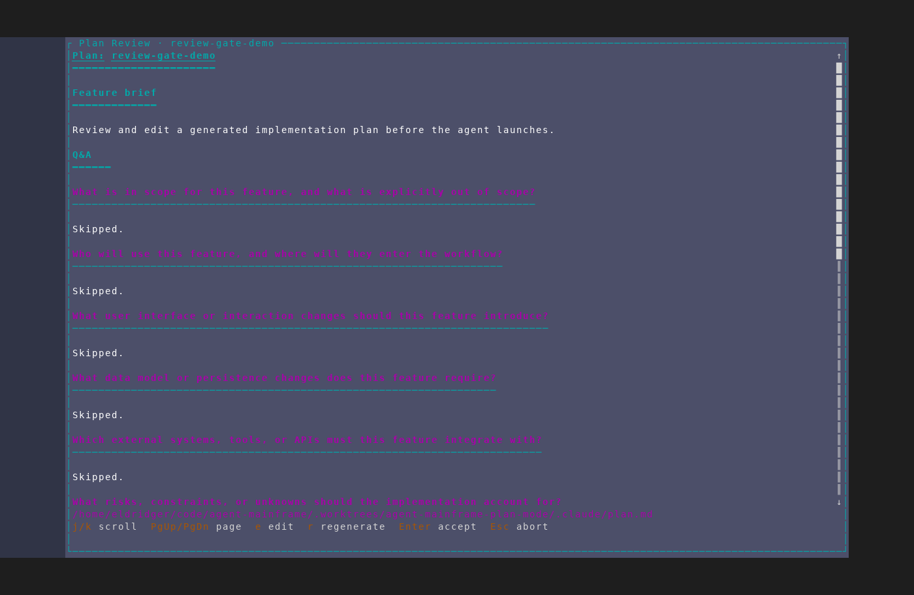
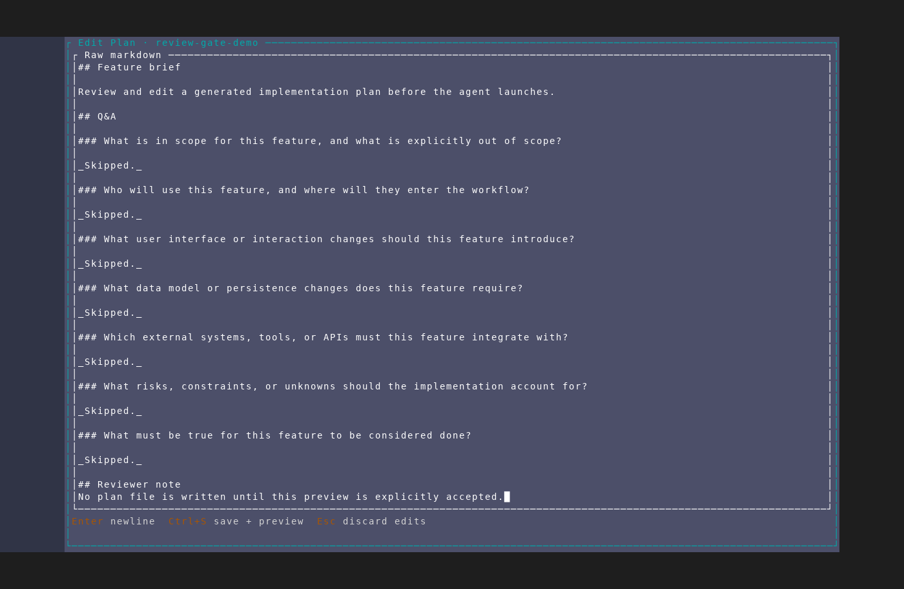
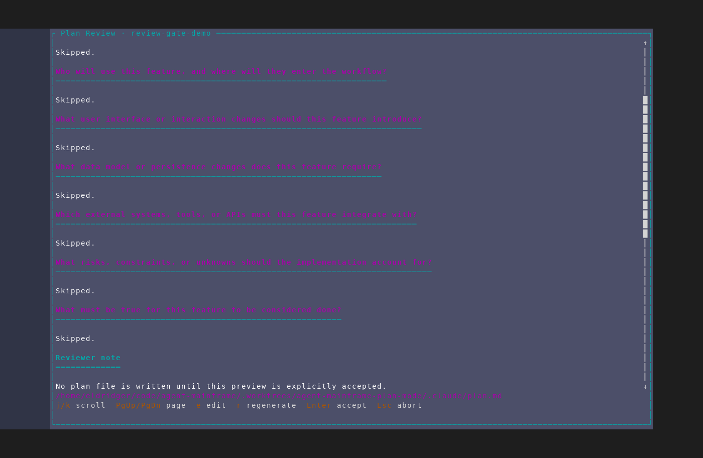
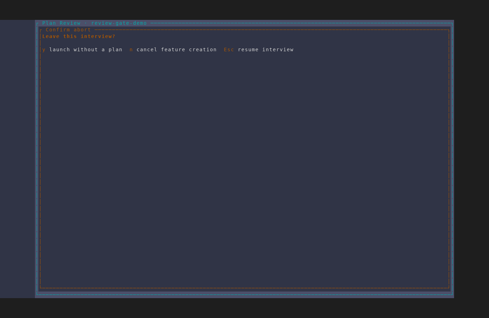

# Plan-mode synthesis review gate

Captured with the `/amf-screenshot` workflow from an isolated AMF instance
against a throwaway repository. The fixture exercises the real plan-mode UI
without reading or modifying user projects, the normal AMF database, or any
agent session.

## 1. Rendered plan review

The synthesized implementation plan opens as rendered markdown. The review
gate exposes scrolling, edit, regenerate, accept, and abort actions.

## 2. Raw markdown editor

Pressing `e` opens the plan in the shared text editor. `Ctrl+S` saves the edit
back to the preview; `Esc` discards the edit.

## 3. Saved edit preview

After saving, the rendered preview reflects the edited markdown while the
feature remains paused behind the acceptance gate.

## 4. Abort confirmation

Pressing `Esc` from the preview asks for confirmation before abandoning the
interview and its deferred feature launch.

