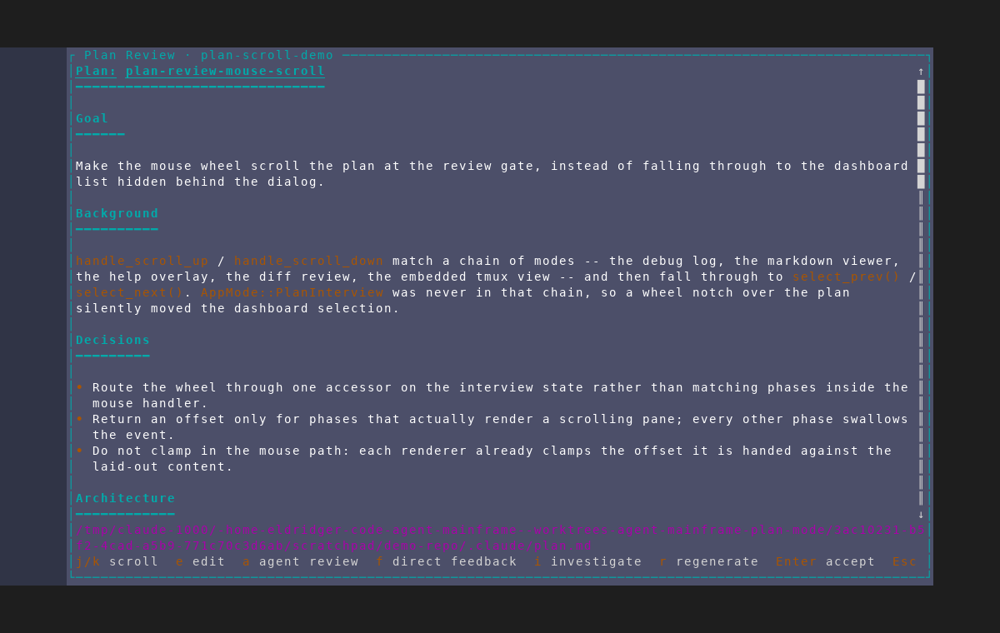
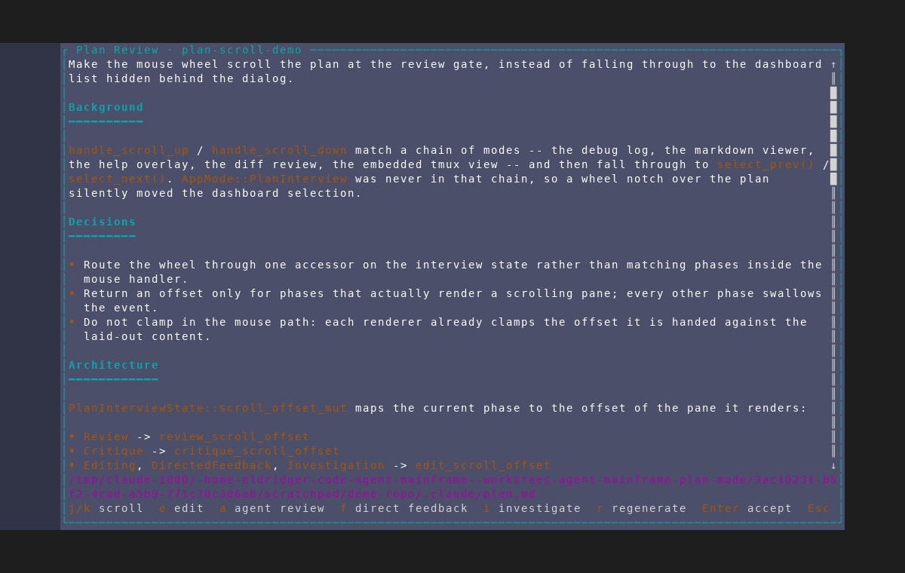
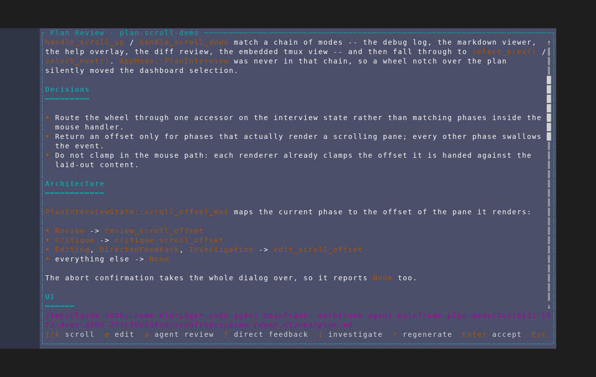
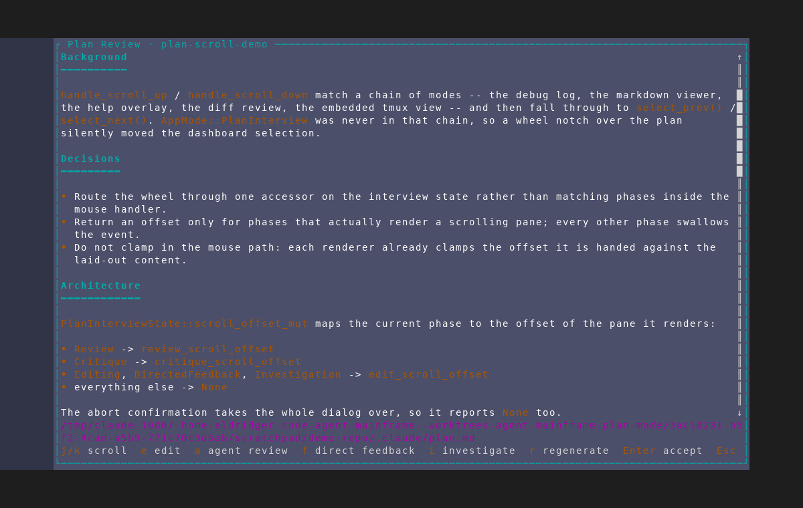

# Mouse-wheel scrolling at the plan review gate

Captured from an isolated AMF instance against a throwaway repository using
`scripts/dev/screenshot/scenarios/plan-review-mouse-scroll.txt`. The fixture
seeds a draft that already contains a synthesized plan (`seed_plan_draft.py
--long`), so reaching the review gate costs no agent tokens, and the plan is
deliberately taller than the pane — a plan that fits has its scroll offset
clamped to zero and nothing to show.

The scenario grammar has no mouse step, so the wheel is injected as the raw
SGR bytes a real terminal sends (`ESC [ < 65 ; col ; row M` for a notch down,
button 64 for a notch up), written into the pane with `tmux send-keys -H`.
crossterm parses those into the same mouse event a physical wheel produces.

## 0. Before the fix

The same scenario against a binary built before the change. Four wheel-down
notches have been sent and the pane is still on the plan's first line: the
events fell through to the dashboard list behind the dialog.

## 1. The review gate, offset 0

The plan as the gate opens, scrollbar thumb at the top of its track.

## 2. Two notches down

Three lines per notch, matching the debug log, markdown viewer and help
overlay. The title line has scrolled off and `Goal` leads the pane.

## 3. Four notches down

`Decisions` and `Architecture` are on screen and the thumb has walked down its
track. Nothing about the dialog's state changed but the offset.

## 4. One notch back up

Up and down are symmetric: one notch moves three lines the other way, landing
on the `Background` heading.

