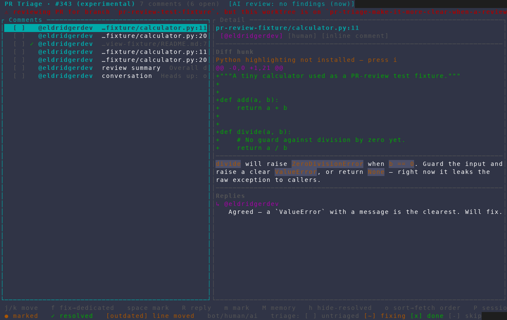
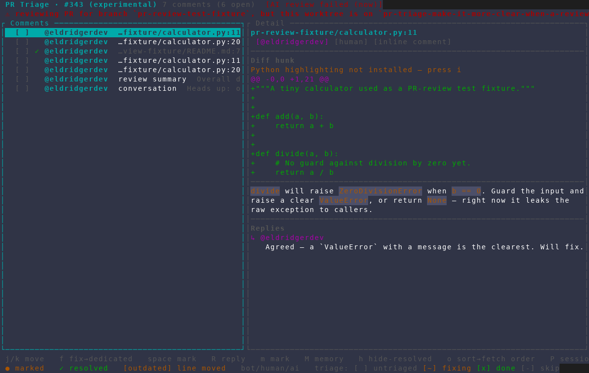

# PR Triage AI Review outcomes

Captured from an isolated AMF instance against the read-only PR-review test
fixture (#343). The scratch AI Review cache was keyed to the fixture's exact
head SHA; no AI agent ran and nothing was written to GitHub.

## Completed with no findings

PR Triage now distinguishes a successful clean review from an unstarted one,
including the relative age of the cached run.

## Failed

A failed review remains visibly distinct and does not expose its detailed error
in the single-line PR Triage header.

Both frames were captured at 120×40 with the isolated
`scripts/dev/screenshot/amf-capture.sh` harness. The matching text captures
were asserted before the PNGs were visually inspected for color and clipping.
