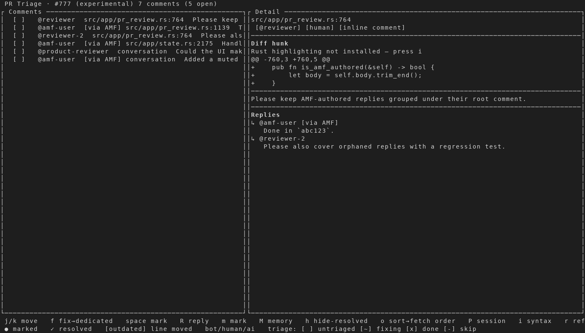
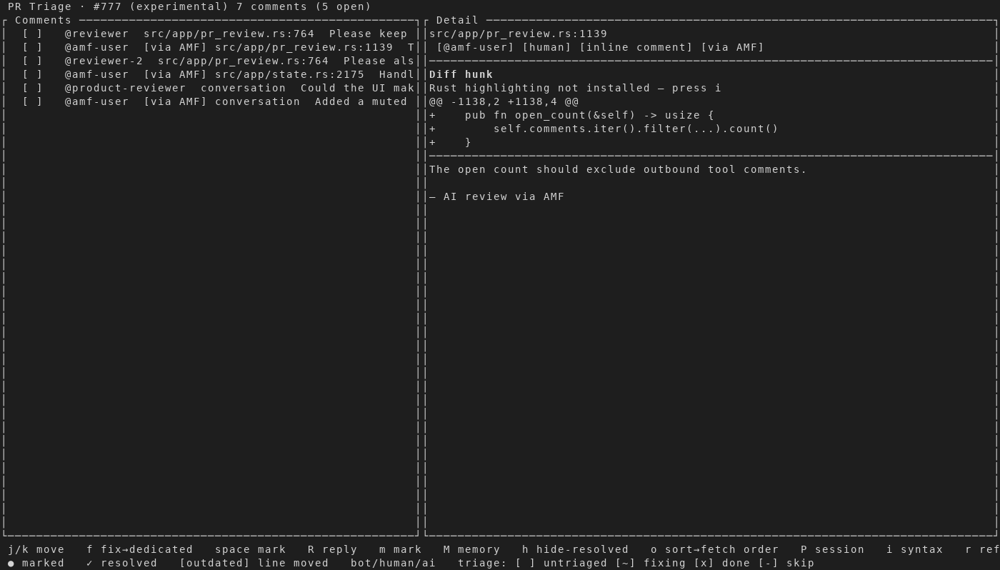
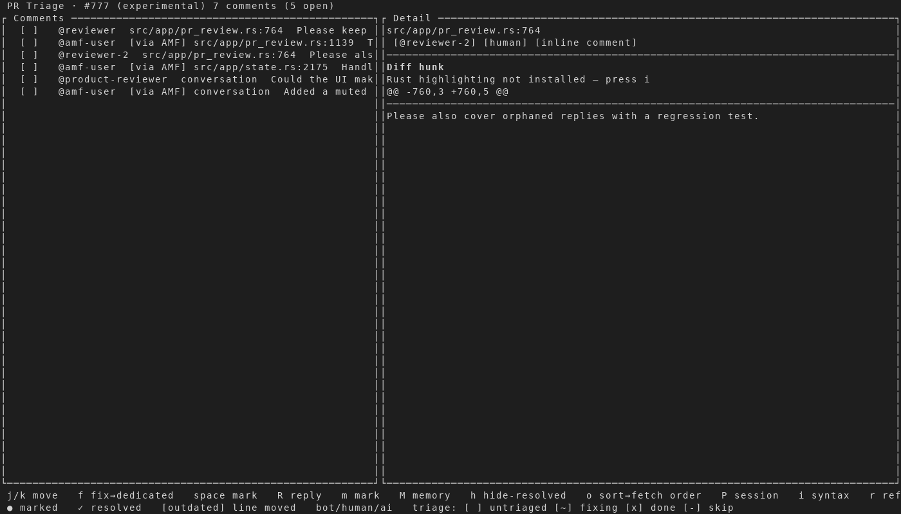

# AMF outbound comments in PR Triage

Captured from an isolated AMF instance against a deterministic, read-only
GitHub CLI fixture. The fixture contains seven comments: five incoming or
standalone comments that remain actionable, one AMF follow-up collated beneath
its root, and one orphaned follow-up retained as context. No GitHub writes were
performed.

## 1. Collated AMF reply

The header reports only three open comments, and AMF's reply is shown under the
root comment's **Replies** section instead of appearing as a duplicate
actionable row.

## 2. AMF-authored standalone finding

An AI Review finding posted by AMF remains actionable after refresh. Its
`[via AMF]` marker provides attribution without removing the normal fix, mark,
reply, and memory actions.

## 3. Human reply

An unrelated human reply remains visible and retains the normal fix, mark,
reply, and memory actions.

