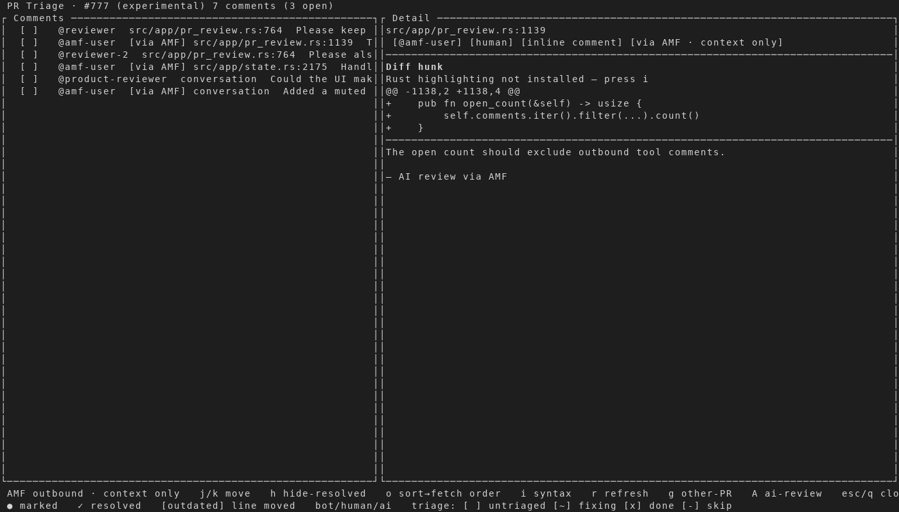

# AMF outbound comments in PR Triage

Captured from an isolated AMF instance against a deterministic, read-only
GitHub CLI fixture. The fixture contains seven comments: three human comments
that remain actionable and four AMF-authored or supporting comments that are
context only. No GitHub writes were performed.

## 1. Collated AMF reply

The header reports only three open comments, and AMF's reply is shown under the
root comment's **Replies** section instead of appearing as a duplicate
actionable row.

## 2. AMF-authored context

Standalone and orphaned AMF comments remain visible with a `[via AMF]` marker.
Selecting one replaces the action shortcuts with an **AMF outbound · context
only** footer.

## 3. Human reply

An unrelated human reply remains visible and retains the normal fix, mark,
reply, and memory actions.

