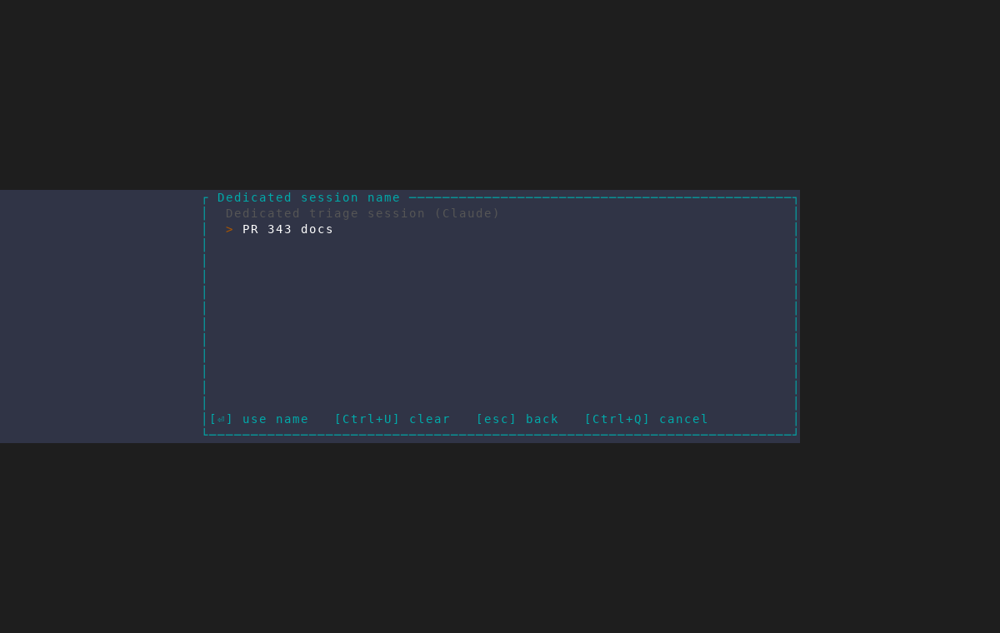
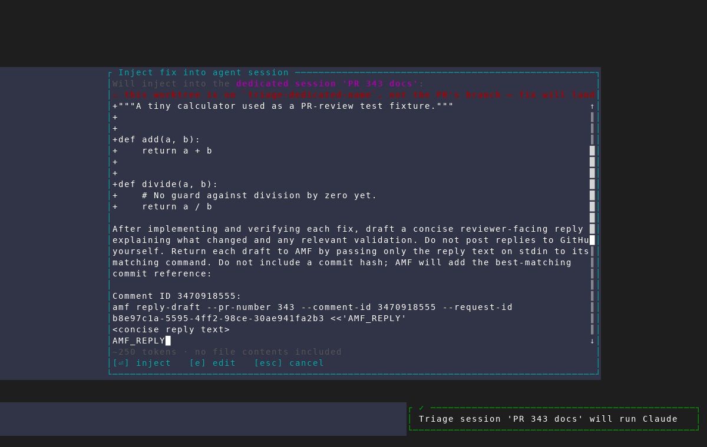

# Named PR Triage sessions

PR Triage asks for an optional session name after a dedicated harness is
selected from the shared `f`/`B` fix-target picker. A custom name creates or
reuses that exact session, allowing multiple triage agents to run concurrently.

The normal fix confirmation repeats the selected name before anything is
injected, making the destination explicit.

These frames were captured at 120×40 against read-only fixture PR #343 with
the isolated `scripts/dev/screenshot/amf-capture.sh` harness. The scenario
stopped before prompt injection, so it launched no triage agent and performed
no GitHub write.
