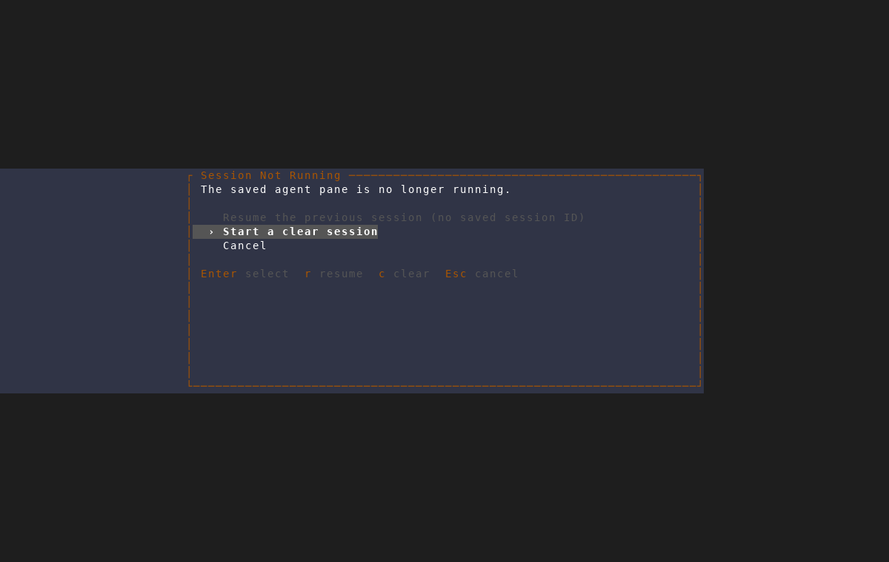

# Stopped session recovery

This capture uses the isolated AMF screenshot driver. The scratch feature's
tmux session was killed to simulate a restart, then `Enter` was pressed on its
persisted Claude pane.

The brand-new scratch harness had not emitted a persisted provider session ID,
so Resume is unavailable and **Start a clear session** is selected. For a
session with a saved ID, Resume is enabled and selected by default.
