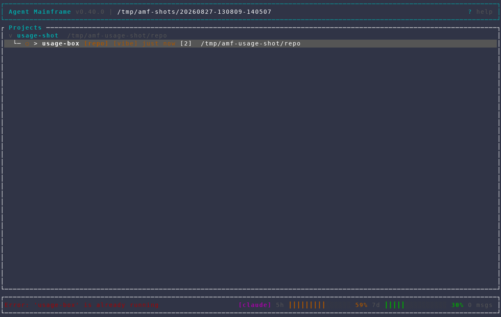
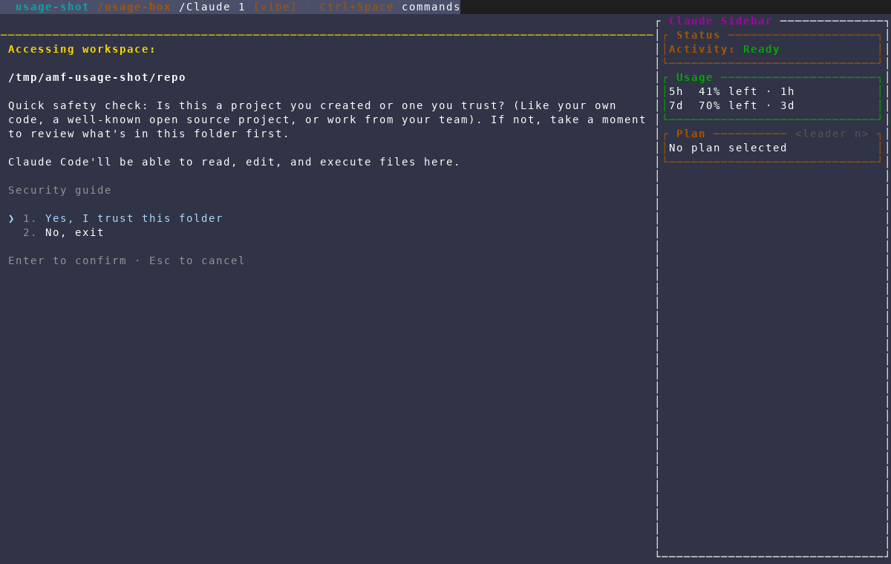

# Harness usage box in the session sidebar

Captured with the repository's `/amf-screenshot` workflow from an isolated AMF
instance against a throwaway project, using the running machine's real Claude
credentials so the rate-limit windows are populated. The walkthrough verifies
that the new **Usage** box sits directly under **Status** and mirrors the
dashboard status bar's `5h` / `7d` figures.

## 1. The dashboard already shows the harness usage bar

Bottom-right of the dashboard status bar: `[claude] 5h ▓ 58%  7d ▓ 30%` —
percentages **used**. This is the existing surface the sidebar box is modelled
on.

## 2. The session sidebar gains a Usage box under Status

In the embedded session view, the agent sidebar now renders a **Usage** box
immediately after **Status** (before **Plan**), one window per line:
`5h  41% left · 1h`, `7d  70% left · 3d` — percentages **remaining**, the
inverse of the dashboard bar (58% used → 41% left, 30% used → 70% left). It is
drawn in the `usage_low` accent colour and is omitted entirely for harnesses
with no usage source (OpenCode, Pi) or before the usage cache is warm.

