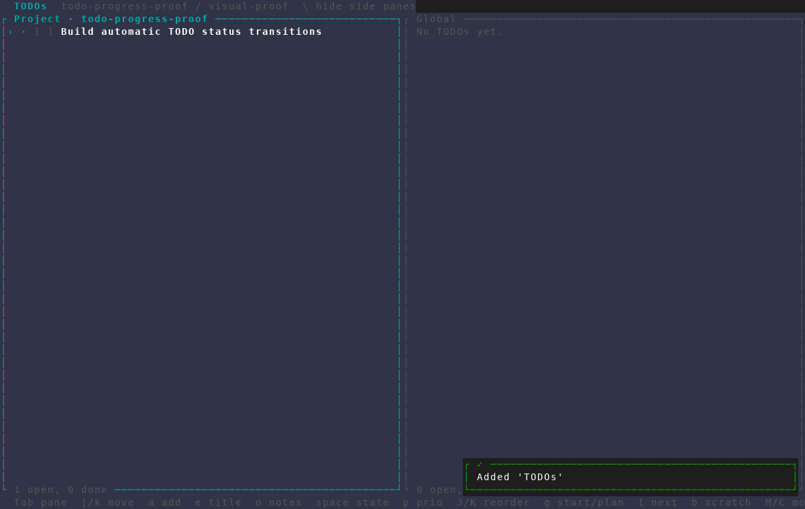
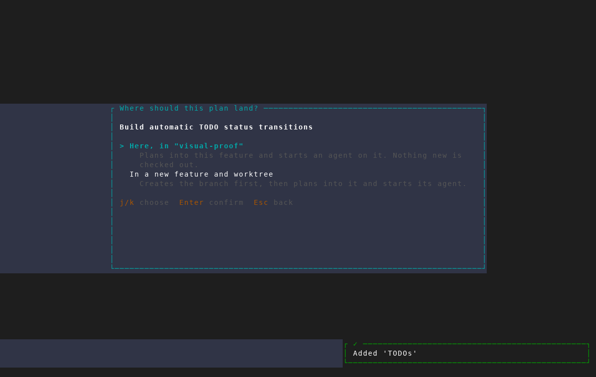
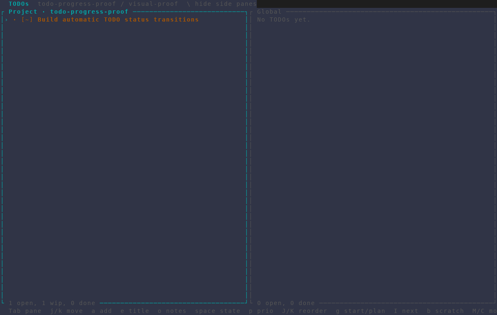

# TODO assignment lifecycle

Captured at 120×40 with AMF's isolated screenshot harness. Frames `001`–`004`
cover the original durable lifecycle: the three states, duplicate-launch guard,
and dashboard **Implement next** flow.

Frames `005`–`007` cover plan-start status tracking:

1. The selected TODO begins as not started (`[ ]`).
2. Choosing **Plan this TODO first** opens the destination picker.
3. Cancelling back to the list leaves the same selected TODO in progress
   (`[~]`) and updates the footer to `1 wip`.

The plan-start frames can be regenerated with
`scripts/dev/screenshot/scenarios/todo-auto-in-progress.txt` and the repository's
`scripts/dev/screenshot/amf-capture.sh` harness.
